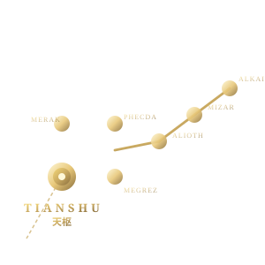

# 天枢 · TIANSHU

> **语言 / Languages**: 中文 | [English](./README.en.md)

<p align="center">
  
</p>

> 一种 SLA 约束的声明式实时数据流编译框架。
> **MapReduce → Spark 的范式跃迁，迁移到自动驾驶车端 ECU。**

[](docs/01-roadmap.md)
[]()
[](docs/adr/0003-build-system.md)
[](docs/adr/0005-lightweight-multiplatform.md)
[](docs/adr/0017-license.md)

---

## 这是什么

**天枢 (TIANSHU)** 是一个实时数据流框架，目标域是自动驾驶车端 ECU。

它要解决的矛盾：现有中间件（Cyber RT / ROS 2 / DDS）性能足够，但开发范式是命令式的——开发者要手写每个 Component、手填 `.dag` / `.conf`，跨算子优化、SLA 验证、容错重放都做不到。

天枢把开发范式升级为**声明式数据流 + 加载期编译**：开发者写 flow 函数描述数据依赖与算子语义，框架在加载期 trace + 静态 C++ codegen，生成与手写代码二进制不可区分的原生 DAG。**运行时零开销**。

## 一句话

```cpp
void perception_flow(Node& node) {
  auto camera = node.reader<CameraMsg>("/perception/front");
  auto lidar  = node.reader<LidarCloud>("/lidar/points");

  node.on_input({camera, lidar}, [&](auto c, auto l) {
    auto det = detect_op(AllLatest::fuse(c, l));
    predict_out.write(predict_op(det));
  })
  .with_sla(SLA{.deadline_ms = 50})
  .with_fallback("perception_flow_lite")
  .with_fault_tolerance({.strategy = SYNC_REPLAY, .replay_window_ms = 50});
}
REGISTER_TRACEABLE_FLOW("perception_flow", perception_flow);
```

mainboard 启动时 dry-run 一次 → trace 出全局数据流图 → 六阶段编译 → 生成 `.so` + `.dag` + `.conf` → 加载运行，**运行时只剩原生代码**。

## 核心特性

| 特性 | 描述 |
|---|---|
| **声明式 DSL** | C++ fluent builder + auto trace，JAX / torch.compile 路线 |
| **加载期编译** | trace → 分析 → 优化 → SLA 规划 → C++ codegen → `.so` |
| **零运行时开销** | 生成的代码与手写二进制不可区分（专利核心承诺） |
| **SLA 硬约束** | 端到端 deadline 编译期验证（RTA），不可满足加载期报错 |
| **GPU 加速与调度**（设计就绪） | GPU 资源管理 + GPU SLA 调度 + 显存预算编译期校验 + OOM 自动降级；接口契约 Phase 0 锁定，实现按 Phase 2/3 渐进（[adr/0006](./docs/adr/0006-gpu-acceleration.md)） |
| **多语言 SDK**（设计就绪） | C++ 核心 + C ABI 边界 + Python/Rust/Go/Node SDK；接口契约 Phase 0 锁定，按 profile 渐进实现（[adr/0007](./docs/adr/0007-api-spec-multi-language.md)） |
| **零拷贝血缘** | ~50ns/消息记录元数据，丢帧自动重放/降级 |
| **三层确定性** | 构建确定性 + 执行确定性 + 血缘可追溯（ISO 26262 ASIL-D） |
| **API 兼容 cyber** | 从 Cyber RT 迁移改动最小（改 include + namespace） |
| **完全独立实现** | 不引用 cyber 任何代码，零 Apollo 许可证风险 |
| **双构建系统** | CMake（开源友好）+ Bazel（团队熟悉、增量快、远程缓存），同一份源代码两套都能跑通 |
| **构建入口标准化** | 必须用原生 `bazel` / `cmake`，禁止 wrap 脚本；场景化覆盖走 `.bazelrc --config=<name>` / `CMakePresets.json` / `build.env` |
| **轻架构 + 5 profile** | 最小依赖（每个依赖走 ADR 审批）；5 个 profile（desktop/server/vehicle/embedded/mcu）覆盖从云端到 MCU |

## 与同类系统的关系

| 系统 | 关系 |
|---|---|
| **Cyber RT** | API 兼容，代码完全独立（不 fork、不 link、不引用） |
| **Spark / Flink** | 范式借鉴（声明式 + 加载期编译），不重合（域不同、约束不同） |
| **ROS 2** | 同域竞品，但 ROS 2 仍是命令式 |
| **JAX / torch.compile** | trace + codegen 路线的灵感来源 |

详见 [docs/00-overview.md §6](./docs/00-overview.md)。

## 项目状态

| 阶段 | 状态 |
|---|---|
| Phase 0：奠基期（仓库 / 文档 / CI） | 🟡 进行中 |
| Phase 1：PoC（验证三个核心假设） | ⏳ 待启动 |
| Phase 2：MVP（替换 Apollo perception mainboard） | ⏳ |
| Phase 3：认证就绪（ISO 26262 ASIL-D） | ⏳ |

详见 [docs/01-roadmap.md](./docs/01-roadmap.md)。

## 文档索引

### 入口

- [docs/00-overview.md](./docs/00-overview.md) — 一句话说清楚 + 四层架构 + 三层确定性
- [docs/01-roadmap.md](./docs/01-roadmap.md) — Phase 0/1/2/3 路线图 + 里程碑 + 风险登记

### 架构决策记录（ADR）

- [docs/adr/0001-dsl-form.md](./docs/adr/0001-dsl-form.md) — DSL 形式选型：fluent builder + auto trace
- [docs/adr/0002-cyber-relation.md](./docs/adr/0002-cyber-relation.md) — 与 Cyber RT 的关系：完全重写，API 兼容
- [docs/adr/0003-build-system.md](./docs/adr/0003-build-system.md) — 构建系统双轨：CMake + Bazel
- [docs/adr/0004-build-entry.md](./docs/adr/0004-build-entry.md) — 构建入口标准化：原生 bazel/cmake，禁 wrap，配置文件覆盖
- [docs/adr/0005-lightweight-multiplatform.md](./docs/adr/0005-lightweight-multiplatform.md) — 轻架构 + 多端多平台（5 profile + 依赖治理 + OSAL/HAL）
- [docs/adr/0006-gpu-acceleration.md](./docs/adr/0006-gpu-acceleration.md) — GPU 加速与调度管理（设计就绪，实现按 profile 渐进）
- [docs/adr/0007-api-spec-multi-language.md](./docs/adr/0007-api-spec-multi-language.md) — 接口规范与多语言支持（C ABI + Python/Rust/Go/Node SDK）
- [docs/adr/0008-message-format-multi.md](./docs/adr/0008-message-format-multi.md) — 消息格式多支持（FlatBuffers / Protobuf / 自定义 struct）
- [docs/adr/0009-doc-code-language.md](./docs/adr/0009-doc-code-language.md) — 文档双语 + 代码注释/commit message 强制英文
- [docs/evaluation/0001-cross-machine-transport.md](./docs/evaluation/0001-cross-machine-transport.md) — 跨机通信选型评估（自研 vs Zenoh / CycloneDDS / Fast-DDS / MQTT / gRPC，**待用户拍板**）
- [docs/adr/0010-transport-shm-infra.md](./docs/adr/0010-transport-shm-infra.md) — Transport Backend 抽象 + 通用 SHM Allocator + INTRA 模式 + offset_ptr（通用基础设施）
- [docs/adr/0011-logging.md](./docs/adr/0011-logging.md) — 日志规范（结构化 / 异步 / 多 sink / 多语言 SDK）
- [docs/adr/0012-parameters.md](./docs/adr/0012-parameters.md) — 参数系统（统一声明访问 / 4 路配置优先级 / 引用 / 导入导出 / 热加载）
- [docs/adr/0013-cross-machine-transport.md](./docs/adr/0013-cross-machine-transport.md) — 跨机 transport（自研 SHM + Zenoh，含接口抽象 + MCU Zenoh-pico）
- [docs/adr/0014-console.md](./docs/adr/0014-console.md) — 控制台（全平台 + 跨机 + TUI+Web，设计完整，实现 Phase 3）
- [docs/adr/0015-discovery-abstraction.md](./docs/adr/0015-discovery-abstraction.md) — 服务发现抽象（DiscoveryBackend 接口，可替换实现）
- [docs/adr/0016-config-format.md](./docs/adr/0016-config-format.md) — 配置格式选型（TOML 主推 + YAML 兼容 + JSON 导入导出）
- [docs/adr/0017-license.md](./docs/adr/0017-license.md) — 许可证 Apache-2.0
- [docs/adr/0018-cpp-style-guide.md](./docs/adr/0018-cpp-style-guide.md) — C++ 风格指南（Google 基础 + clang-format/tidy 强制）
- [docs/adr/0019-coroutine-strategy.md](./docs/adr/0019-coroutine-strategy.md) — 协程策略（Phase 1 回调调度 / Phase 2 C++20 stackless）
- [docs/evaluation/0003-console.md](./docs/evaluation/0003-console.md) — 控制台方案评估（独立进程访问任意节点对象，**待用户拍板**，Phase 3）

## 命名与品牌

**天枢**：北斗七星之首（Dubhe / α Ursae Majoris），枢纽的隐喻。

- 天枢是北斗的"指针"，指向北极星 → 框架是"指向 SLA 满足"的导航者
- 枢 = 枢纽 = middleware → 中间件的语义命中
- 七星拓扑天然契合 DAG 数据流图

Logo 双方向（branding/assets/）：

- `tianshu-starchart-*.svg` — 古星图风格（夜空 + 鎏金 + 七星连线）
- `tianshu-geometric-*.svg` — 极简几何（线条 + 节点 + DAG 拓扑）

## 维护者

Pride Leong · 2026

## 许可证

**Apache License 2.0**（详见 [LICENSE](./LICENSE) 与 [docs/adr/0017-license.md](./docs/adr/0017-license.md)）。专利相关权利在开源许可范围内，详见后续 LICENSE 文件。
