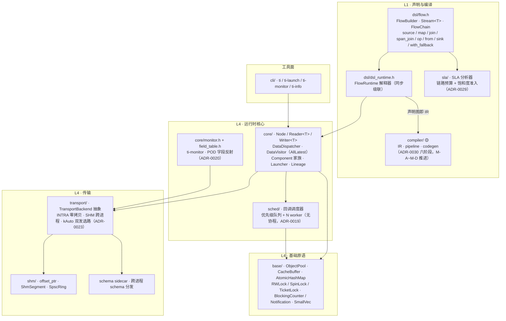
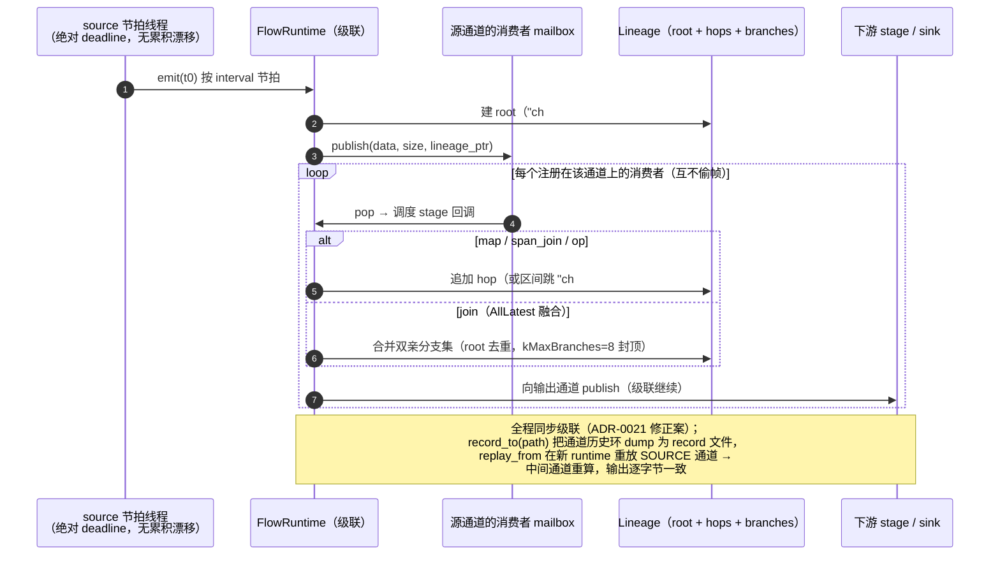
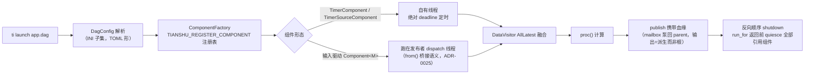

# 天枢总体架构（as-built）

> **文档定位**：框架现状的系统视图——分层、模块地图、一条消息的生命周期。学完 [00-overview.md](../00-overview.md)（愿景叙事）后从这里进入实现。
> **维护契约**：模块增删、跨模块机制变化时必须更新本文（见 [README.md 维护契约](./README.md#维护契约每次迭代必须执行)）。
> **最后同步**：2026-09-09 · Phase 1 PoC

---

## 1. 一个关键映射：逻辑分层 ≠ 代码目录

ADR 体系用 **L1–L4 逻辑分层**讨论设计（术语边界见 [ADR-0002](../adr/0002-cyber-relation.md)），但**代码目录是物理组织，两者不是一一对应**。初学者最容易在这里迷路，先给映射表：

| 逻辑层 | 定义（ADR-0002） | 代码落点（as-built） |
|---|---|---|
| L1 · DSL / 编译器 | flow 声明与加载期编译 | `dsl/`（声明 + 解释器）+ `compiler/`（IR / 管线 / codegen，🟡 推进中） |
| L2 · 血缘 / 容错 | 逐消息溯源、恢复 | `core/lineage.h`（值对象）+ `dsl/`（map/join 自动追加 hop、区间跳、恢复协议、`with_fallback` 降级阶梯 [ADR-0031](../adr/0031-fallback-degradation.md)）+ `dsl/record*.h`（记录回放基底） |
| L3 · SLA | 加载期 deadline 验证与预算分配 | `sla/`（分析器 + 统计）+ `dsl/` 的 `with_sla` / `with_wcet` 声明面 |
| L4 · 运行时原语与传输 | 中间件底座 | `base/` `sched/` `core/` `transport/` `shm/` + `cli/`（ti 家族） |

> 规律：**声明面和解释器都在 `dsl/`，分析器在 `sla/` / `compiler/`，原语在 L4 各目录**。L2/L3 的"能力"散布在 L4 数据面之上——这正是"声明式框架"的形态。

## 2. 分层视图



> 箭头 = 主要供给/驱动关系（细粒度依赖见各 [模块页](#3-模块地图) §4）。

## 3. 模块地图

| 模块 | 目录 | 状态 | 一句话职责 | 详档 |
|---|---|---|---|---|
| 基础原语库 | `tianshu/base/` | ✅ | 无锁/低开销数据结构与同步原语，全框架地基 | [modules/base.md](./modules/base.md) |
| 调度器 | `tianshu/sched/` | ✅ | 回调式优先级调度（Phase 1 无协程） | [modules/sched.md](./modules/sched.md) |
| 运行时核心 | `tianshu/core/` | ✅ | Node/typed 读写器、分发与融合、Component、Launcher、Lineage、Monitor | [modules/core.md](./modules/core.md) |
| 传输层 | `tianshu/transport/` + `tianshu/shm/` | ✅* | INTRA + SHM 跨进程 + kAuto 自动选路（*跨机 Zenoh 未实现，ADR-0013） | [modules/transport.md](./modules/transport.md) |
| 声明式 DSL 与血缘 | `tianshu/dsl/` | ✅ | flow 声明、解释执行、切片输入、状态即数据、record v1/v2、fallback 降级阶梯 | [modules/dsl.md](./modules/dsl.md) |
| SLA 编译 | `tianshu/sla/` | ✅ | 加载期 deadline 验证 + 预算下行分摊 | [modules/sla.md](./modules/sla.md) |
| L1 编译器 | `tianshu/compiler/` | 🟡 | 声明图 → 优化 → 源码 codegen → `.so`（Phase 1 H2 主战场） | [modules/compiler.md](./modules/compiler.md) |
| ti CLI 家族 | `tianshu/cli/` | ✅ | ti / ti-launch（DAG 装载）/ ti-monitor（通道观测）/ ti-info | [modules/cli.md](./modules/cli.md) |

**验证/示例资产**：`tests/`（按模块镜像：base/sched/core/transport/shm/dsl/compiler）、`benchmarks/`（object_pool / shm_transport / lineage / codegen_vs_handwritten）、`examples/`（dsl_demo → lidar_imu → full_chain → record_replay → state_recovery，难度递进；叙事讲解见 [03](../03-full-chain-demo.md)/[04](../04-data-model-generalization.md)/[05](../05-dsl-getting-started.md)）。

## 4. 一条消息的生命周期

### 4.1 DSL 解释执行路径（在线）



### 4.2 Component / DAG 装载路径（ti-launch）



### 4.3 跨进程路径（kAuto）

同进程走 INTRA 零拷贝 fan-out；`AutoWriter` 同时双发 SHM 广播（零读者时近乎免费），读端按 `IntraChannelRegistry` 判定本进程是否有真实写者来选路——**任意创建顺序皆正确，无需 discovery**（ADR-0023）。段布局、CAS 初始化、进程共享 condvar 唤醒等细节见 [modules/transport.md](./modules/transport.md) §3。

## 5. 代码组织与构建视图

```
tianshu/
├── include/tianshu/     # 公共 API（唯一出口，按模块分目录；ADR-0007 C ABI 演进面）
│   ├── base/ sched/ core/ shm/ transport/ dsl/ sla/ compiler/
│   └── version.h        # C ABI 版本接口
├── src/                 # 私有实现（扁平 .cc，与头文件目录对应）
├── cli/                 # ti 家族入口 main
examples/ tests/ benchmarks/   # 与模块镜像组织；tests 含 fork 级跨进程用例
```

- **双构建零警告**（CMake 主 + Bazel 验证轨，ADR-0003/0004）；构建入口只允许原生 `cmake` / `bazel` 命令。
- **5 profile**（desktop/server/vehicle/embedded/mcu）编译期裁剪（ADR-0005）；当前 desktop 已验证。
- 依赖白名单 `ALLOWED_DEPS.txt`（ADR-0005 审批制）。
- 覆盖率权威管线（GCC + lcov）见 [development/coverage-guide.md](../development/coverage-guide.md)。

## 6. 从这里去哪

- 深入某模块 → [modules/](./modules/) 对应页（§2 API / §3 内部设计 / §5 决策史）
- 查设计动机与被否方案 → [adr/README.md](../adr/README.md)（按域检索）
- 动手写第一条 flow → [05-dsl-getting-started.md](../05-dsl-getting-started.md) → 跑 `examples/dsl_demo`
- 看全链路闭环叙事 → [03-full-chain-demo.md](../03-full-chain-demo.md)
