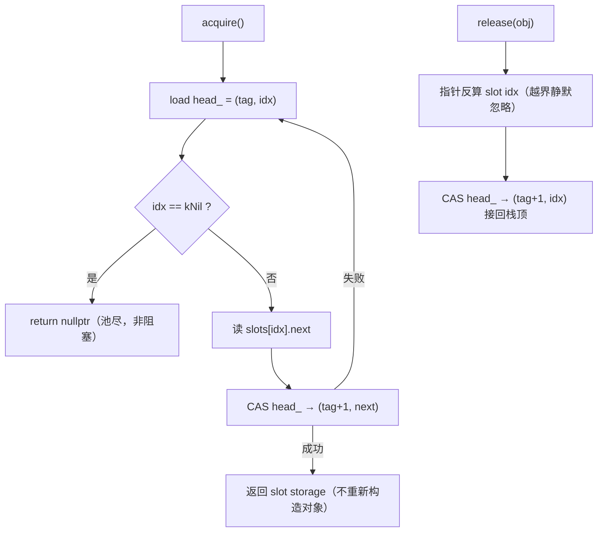
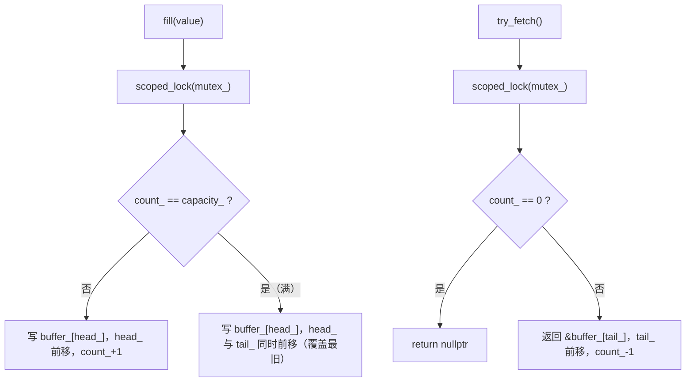

# L4 基础原语库（`tianshu/include/tianshu/base/`）

> 状态：✅ 已实现（Phase 1）——[L4-PRIM-1..6](../../02-development-plan.md) 六件套全量落地，另含 ADR-0030 增补的 `SmallVec`；header-only、零内部依赖
> 代码：`tianshu/include/tianshu/base/`（header-only，无对应 `src/` 文件）
> 关键 ADR：[ADR-0010 Transport/SHM 基础设施](../../adr/0010-transport-shm-infra.md) · [ADR-0018 C++ 风格指南](../../adr/0018-cpp-style-guide.md) · [ADR-0019 协程策略](../../adr/0019-coroutine-strategy.md) · [ADR-0030 L1 编译器](../../adr/0030-l1-compiler.md)
> 测试：`tests/base/*.cc`（7 个文件） · 基准：`benchmarks/object_pool_benchmark.cc` · 示例：-
> 最后同步：2026-09-09 · commit `86b9ff3`

## 1. 职责与边界（做什么 / 明确不做什么）

**做什么**：

- 为 transport / core / dsl 各层提供共享的底层并发与内存原语，按主题分六组：
  **内存池**（ObjectPool）、**环形缓存**（CacheBuffer）、**并发 map**（AtomicHashMap）、
  **锁原语**（RWLock / SpinLock / TicketLock）、**同步原语**（BlockingCounter / Notification）、
  **inline 容器**（SmallVec）。
- 热路径免分配：固定容量预分配 + 索引寻址是全库的一致取向。
- 为 Phase 2 SHM 化铺路：核心结构均以 index 而非指针管理内部链表（ADR-0010 附录的 SHM 兼容策略）。
- 严格遵守 ADR-0018（Google 风格 + 100 列 + C++20，命名/RAII 纪律贯穿公开 API）。

**明确不做什么**：

- 不做 SHM 分配本身——`tianshu::shm::ShmPool` 是 L4-TRANS-22 的职责；本库 Phase 1 只写堆版本，"外部内存构造函数"按 ADR-0010 附录推迟到 Phase 2 统一加。
- 不做 `StringUtils` / `PathUtils` / `Time`（L4-PRIM-7）与 `SignalHandler`（L4-PRIM-8）——规划中，未实现。
- 不做调度、传输、血缘——只提供被它们复用的原语；base 不 include 任何其它 `tianshu::` 模块。
- 不含日志/监控埋点——热路径零开销优先。

## 2. 公共 API 速览

| 主题 | 类型 | 职责 | 关键约束 / 复杂度承诺 |
|---|---|---|---|
| 内存池 | `ObjectPool<T>` | 无锁对象池（Treiber 栈，tagged index 防 ABA） | 固定容量，构造期预分配并默认构造全部 T；`acquire()` O(1) CAS，耗尽返回 `nullptr`（非阻塞）；`release()` O(1)；`available()` O(n) 遍历 free-list；T 需可默认构造；容量受 32-bit index 限制；禁拷贝/移动 |
| 内存池 | `PooledPtr<T>` / `make_pooled()` | 池对象的独占所有权 RAII 句柄 | move-only；析构自动 `release()`；`explicit operator bool()` 判空 |
| 环形缓存 | `CacheBufferBase` | 类型擦除基类（`fill_bytes()`），供 DataDispatcher 无模板填充（L4-CORE-6） | byte-oriented fill 要求 T 可平凡拷贝 |
| 环形缓存 | `CacheBuffer<T>` | 线程安全环形缓冲，满时覆盖最旧（overwrite-oldest） | `std::mutex` 保护；`fill` / `try_fetch`（消费）/ `observe`（只读窥视）均 O(1)；返回指针仅在**下一次 fill/try_fetch 前**有效；`empty/full/size/capacity` |
| 并发 map | `AtomicHashMap<K, V, Hash, KeyEqual>` | 线程安全哈希表 | RWLock + `std::unordered_map`；多读并发、写互斥；`find()` 返回 `std::optional<V>` **拷贝**（规避锁生命周期问题）；`for_each()` 持读锁回调；insert 同 key 覆盖 |
| 锁原语 | `RWLock` + `ReadGuard` / `WriteGuard` | 读写锁（`std::shared_mutex` 包装）+ RAII 守卫 | 多读并发 / 写独占；`try_read_lock` / `try_write_lock` |
| 锁原语 | `SpinLock` | atomic_flag 自旋锁 | `test_and_set` 自旋 + `yield` 让核；最低延迟、**无公平性保证**；满足 Lockable |
| 锁原语 | `TicketLock` | FIFO 公平票锁 | `ticket`/`serving` 双原子计数，取号排队；延迟略高于 SpinLock；满足 Lockable |
| 同步原语 | `BlockingCounter` | 可增减计数屏障 | `increment`/`decrement`/`wait`/`count`；count 降到 ≤0 时 `notify_all` |
| 同步原语 | `Notification` | 一次性事件信号 | `notify`/`has_been_notified`/`wait`；notify 后永久置位，多次 notify 幂等 |
| 容器 | `SmallVec<T, N>` | 固定 inline 容量的 vector | 前 N 个元素 inline 零堆分配，超出倍增溢出到堆；`push_back` 均摊 O(1)；刻意最小集（无 insert/erase/reserve） |

真实用法（摘自测试）：

```cpp
// 来源：tests/base/object_pool_test.cc（PooledPtrAutoRelease / PooledPtrMoveSemantics）
tianshu::base::ObjectPool<TestData> pool(2);
{
  auto ptr = tianshu::base::make_pooled(pool);  // RAII 借用，available: 2 → 1
  ASSERT_TRUE(ptr);
  ptr->value = 77;
}  // 析构自动 release，available 回到 2

// 来源：tests/base/cache_buffer_test.cc（OverwriteOldestWhenFull）
tianshu::base::CacheBuffer<int32_t> buf(2);
buf.fill(10);
buf.fill(20);                  // 满
buf.fill(30);                  // 覆盖最旧：10 被挤掉
auto* p1 = buf.try_fetch();    // *p1 == 20
auto* p2 = buf.try_fetch();    // *p2 == 30
```

## 3. 内部设计

### 3.1 内存池（`ObjectPool`）——Treiber 栈 + tagged index



- **内存布局**：连续 `Slot` 数组一次 `::operator new[]` 分配；每 slot = `aligned_storage` + `std::atomic<Index> next`；构造期对全部 slot placement-new 默认构造，析构期逐个析构（测试 `DestructorDestroysObjects` 用存活计数锁定）。
- **ABA 安全**：64-bit `head_` 打包为 32-bit tag + 32-bit index，单原子 CAS 同时推进 tag，消除 Treiber 栈经典 ABA。
- **锁策略**：全程无锁；acquire 失败用 `compare_exchange_weak` 循环重试。
- **异常路径**：池尽返回 `nullptr`（调用方决策，不阻塞不抛）；`release(nullptr)` no-op；acquire 不调用构造器——对象数据**跨 acquire/release 保留**（`DataPersistsAcrossAcquire` 锁定），适合复用已初始化缓冲。

### 3.2 环形缓存（`CacheBuffer`）——覆盖最旧的互斥环形缓冲



- **内存布局**：`std::vector` 预分配 capacity 槽 + `head_/tail_/count_` 三索引；index 寻址（非指针），为 SHM 迁移预留（ADR-0010 附录）。
- **锁策略**：单 `std::mutex`，每操作一个 `scoped_lock`——刻意粗粒度，Phase 1 以简单正确为先。
- **覆盖语义**：满时写入使 `tail_` 同步前移，等价 keep-latest 的消息缓存语义（与 ADR-0019 的 AllLatest 融合用法匹配）。
- **等待/唤醒**：无阻塞等待——消费侧空时返回 `nullptr`，由上层（DataVisitor/调度器 mark_waiting）决定等待策略。

### 3.3 并发 map（`AtomicHashMap`）

- 读多写少假设：`find/contains/size/empty/for_each` 走 `ReadGuard` 并发，`insert/erase/clear` 走 `WriteGuard` 互斥。
- `find()` 返回值拷贝（`std::optional<V>`）而非引用——出锁后引用悬空是经典陷阱，拷贝语义把锁生命周期问题在接口层消灭。
- 头文件注释明确：Phase 2 可在**同一接口**后换成无锁开放寻址。

### 3.4 锁原语（`RWLock` / `SpinLock` / `TicketLock`）

- `SpinLock`：自旋 + `std::this_thread::yield()` 让核，避免在超线程环境下烧邻居核；适合极短临界区。
- `TicketLock`：`fetch_add` 取号 + `serving` 叫号，FIFO 公平、无饥饿；`try_lock` 用双计数比较 + CAS。
- 三者均满足 Lockable concept，可直接配合 `std::scoped_lock` / `std::lock_guard`（测试 `ScopedLockCompatible` 锁定）。

### 3.5 同步原语（`BlockingCounter` / `Notification`）

- 均为 mutex + condition_variable 实现；`wait()` 用谓词形式防虚假唤醒。
- `BlockingCounter::decrement()` 在 count ≤ 0 时 `notify_all`；支持归零后再 increment 复用。
- `Notification` 一次性置位；多个 waiter 全部被唤醒（`MultipleWaitersAllNotified` 锁定）。

### 3.6 容器（`SmallVec`）——为血缘热路径而生

- 存在理由（ADR-0030 D8 L2b）：Lineage 常见链只带 1-2 个分支、几跳，inline 容量让常见拷贝/构造路径零堆分配。
- **内存布局**：`inline_[N * sizeof(T)]` 原始未初始化字节 + `heap_` 溢出指针 + `size_/capacity_`；元素 push 时 placement-new、删除时显式析构。inline buffer 刻意不零初始化——否则每次 Lineage 构造白做 ~500 字节 memset（H2 回归教训，头文件注释存档）。
- **用户提供的空构造函数体**（非 `= default`）：让 `const SmallVec EMPTY;`（Lineage::hops）合法且成员仍保 NSDMI。
- 溢出 `grow()` 容量倍增；move 语义分两路：inline→inline 逐元素搬移并清空源，heap→直接窃取指针。

## 4. 与其它模块的关系

- **core**：`DataDispatcher`（`include/tianshu/core/data_dispatcher.h`）复用 `CacheBuffer`（经 `CacheBufferBase` 类型擦除执行 `fill_bytes`）与 `SpinLock`；`DataVisitor` 复用 `CacheBuffer`；`Lineage` 的 hops 用 `SmallVec`。
- **dsl**：`DslRuntime`（`include/tianshu/dsl/dsl_runtime.h`）复用 `SmallVec` 与 `SpinLock`。
- **transport / shm**：ADR-0010 把本库定位为通用 SHM 基础的底座——L4-TRANS-22（`ShmPool` 的 `get_object_pool<T>()）显式依赖 L4-PRIM-1；Phase 1 SHM channel 采用固定布局未直接复用，但 index-based 内部结构是 Phase 2"外部内存构造函数"方案的前提。
- **sched**：ADR-0019 的多通道融合机制（数据到齐 → `mark_ready`）构建于 DataVisitor + CacheBuffer 之上。
- **依赖方向**：base 不依赖任何其它 tianshu 模块（include 检查为证），是最底层。

## 5. 设计决策与被否方案（ADR 摘要 + rejected alternatives）

- **ADR-0010（SHM 底座）**：基础类**不感知 SHM**，统一在分配器层解决——否决"每个类加 SHM 变体"（类爆炸）；Phase 1 只写堆版本——否决"直接 SHM 构造"（引入依赖，推迟 Phase 2）；自研 `offset_ptr`——否决 Boost.Interprocess（ADR-0005 依赖治理禁 Boost 全套）。ObjectPool 的 index-based free-list 被点名"天然跨进程安全，不需要 offset_ptr"。
- **ObjectPool**：tagged-index Treiber 栈——否决裸指针 free-list（ABA 且 SHM 不安全）；开发计划中"无锁/带锁两版"，as-built 仅无锁版；构造期一次性预分配 + 默认构造——否决惰性构造（acquire 路径引入分支与构造异常）。
- **AtomicHashMap**：Phase 1 用 RWLock + `std::unordered_map`（简单、正确、可测）——无锁开放寻址列为 Phase 2 同接口替换项；`find` 拷贝返回——否决引用返回（锁生命周期）。
- **RWLock**：`std::shared_mutex` 直包——自旋优化版列为 Phase 2 可选（头文件注释）。
- **SmallVec**：自研 ~180 行——否决 `absl::InlinedVector` / `llvm::SmallVector`（第三方依赖治理）；刻意不提供 insert/erase/reserve——贴合"只增长"的使用形态，避免过度工程。
- **ADR-0018（风格）**：Google 基础 + 100 列 + C++20；强制 RAII、禁裸 new/delete——ObjectPool 内部 `::operator new[]` 是受控豁免点（带 NOLINT 标注与注释）；命名规范（snake_case 函数、`kNil` 常量、PascalCase 类型）贯穿本库公开面。

## 6. 测试 / 基准 / 示例入口

- `tests/base/object_pool_test.cc`：空池/耗尽/复用/析构计数 + `PooledPtr` 全套移动语义 + 4 线程 × 10k 次 acquire/release 并发争用。
- `tests/base/cache_buffer_test.cc`：FIFO 次序、覆盖最旧、单容量、多轮回绕 + 50k 次生产者-消费者并发。
- `tests/base/atomic_hash_map_test.cc`：增删改查、rvalue key、`for_each` + 4 线程 × 5k 并发插入与逐键校验。
- `tests/base/rw_lock_test.cc`：多读并发、写独占、RAII 守卫、4 线程 × 10k 写竞争。
- `tests/base/spin_lock_test.cc`：SpinLock / TicketLock 各自的基本锁语义、`std::scoped_lock` 兼容性、4 线程互斥计数。
- `tests/base/sync_test.cc`：BlockingCounter 计数/唤醒/复用 + Notification 一次性、多 waiter。
- `tests/base/small_vector_test.cc`：inline 快路径、溢出增长、跨 inline/heap 边界的拷贝与移动全组合、自移动安全（ADR-0030 D8 L2b 的正确性底盘）。
- 基准：`benchmarks/object_pool_benchmark.cc`——`BM_ObjectPoolAcquireRelease`（裸指针）、`BM_ObjectPoolPooledPtr`（RAII 句柄）、`BM_RawNewDelete`（new/delete 基线对照）。
- 示例：-（examples/ 现聚焦 transport/dsl 演示，无 base 专属示例）。

## 7. 已知限制与演进方向

- **覆盖率**：分支覆盖率提升中（最近一次 gcovr：object_pool.h 46% / cache_buffer.h 60% / atomic_hash_map.h 53% / sync.h 55%；项目目标 ≥90%，补测进行中）。
- `ObjectPool::available()` 是 O(n) 链遍历，只宜诊断用；无 per-thread cache（高争用场景的下一步）；容量上限受 32-bit index/tag 打包约束。
- `CacheBuffer` 互斥粒度粗；SPSC 场景可换无锁环（SHM channel 已在 ADR-0010 决策 5.1 用固定布局 SPSC ring 先行验证）。
- `AtomicHashMap` 写多场景退化为串行；`for_each` 回调持读锁期间过长会阻塞写者。
- `SmallVec` 无 shrink_to_fit / reserve / insert / erase；inline 容量 N 固化在类型里。
- 演进方向（均已预留接口不变原则）：Phase 2 外部内存构造函数（ShmPool 集成，ADR-0010 附录）、AtomicHashMap 换无锁开放寻址、RWLock 自旋优化；L4-PRIM-7/8（工具类与信号处理）按计划补齐。
