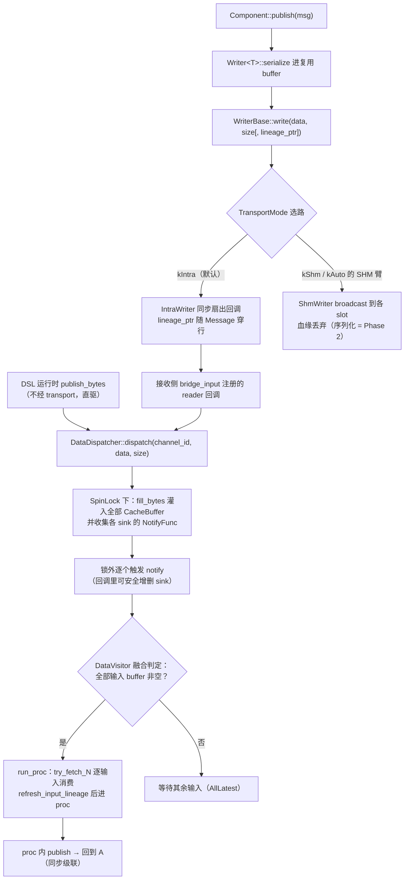
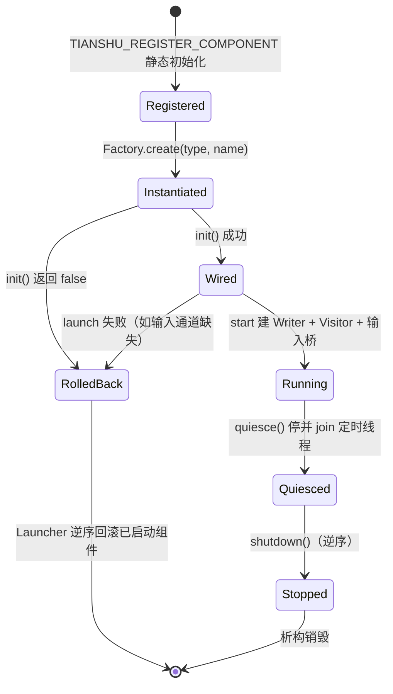

# L4 运行时核心（`tianshu/core`）

> 状态：✅ 已实现（Phase 1）——[L4-CORE-1..7/10](../../02-development-plan.md) + [L4-COMP-1/2/3/10](../../02-development-plan.md) + [L4-MAIN-1](../../02-development-plan.md) 全量落地：类型化消息、进程内数据面（Dispatcher/Visitor）、Component 框架、Lineage 值对象、DAG 启动器、monitor 核心、POD 字段表，是 DSL 与 ti CLI 家族之下的运行时地基
> 代码：`tianshu/include/tianshu/core/`（13 个头文件：node / typed_reader / typed_writer / message_traits / message_concept / data_visitor / data_dispatcher / data_notifier / component / lineage / launcher / monitor / field_table）· `tianshu/src/{node,data_dispatcher,data_notifier,component,lineage,launcher,monitor,field_table}.cc`
> 关键 ADR：[ADR-0002 与 Cyber RT 关系 + 术语边界](../../adr/0002-cyber-relation.md) · [ADR-0022 Lineage v0/v0.5](../../adr/0022-lineage-v0.md) · [ADR-0020 消息反射与 monitor](../../adr/0020-message-reflection-monitor.md) · [ADR-0025 from() 组件引用](../../adr/0025-from-component-reference.md)（含 2026-09-10 双输入修订）
> 测试：`tests/core/*.cc`（7 个文件） · 示例：`examples/hello_dag.cc` · `examples/avp_devices.cc` · `examples/{shm_talker,shm_listener}.cc`
> 最后同步：2026-09-10 · commit `c8ed440`

---

## 1. 职责与边界（做什么 / 明确不做什么）

**做什么**：

- **类型化消息层**（L4-CORE-1/2/3/10）：`MessageTraits<T>` 序列化 traits + `MessageConcept` C++20 concept + `Reader<T>` / `Writer<T>` 类型化封装——消息格式抽象的唯一实现是 POD（trivially copyable 自动特化 + `TIANSHU_TRAITS_POD` 命名特化）。
- **Node 工厂**（L4-CORE-4）：每个 Node 持有一个 `HybridTransport`，按 `TransportMode` 建 untyped / typed 端点；`create_typed_writer<T>` 在 T 带 POD 字段表时自动把 schema 编进 `ChannelConfig::schema_blob`（sidecar 发布的入口）。
- **进程内数据面**（L4-CORE-5/6/7）：`DataDispatcher`（单例，channel_id → CacheBuffer sinks，锁外回调）+ `DataVisitor<T0..T3>`（AllLatest 多输入融合，1-4 输入偏特化）+ `DataNotifier`（channel_id → 唤醒回调注册表）。
- **Component 框架**（L4-COMP-1/2/3/10）：`ComponentBase` 生命周期（init/shutdown/launch/quiesce）、`Component<M0, TOut>` 与 `TwoInputComponent<M0, M1, TOut>`（AllLatest 融合）、`TimerComponent`（绝对 deadline 定时）与 `TimerSourceComponent<TOut>`（传感器驱动入口）、`ComponentFactory` + `TIANSHU_REGISTER_COMPONENT` 注册宏、`set_out_channel_override`（flow 声明通道覆盖类声明，ADR-0025）。
- **Lineage 值对象**（ADR-0022 + v0.5 分支模型）：root + hops + branches 的逐消息血缘；区间跳（`seq_end`，ADR-0026 切片出处）；join 的 root 去重 merge（环安全，`kMaxBranches = 8` 兜底）。
- **DAG 启动器**（L4-MAIN-1）：`DagConfig` INI 子集解析（`[component name]` + `type` / `inputs` / `interval_ms`）+ `Launcher`（factory 实例化 → init → launch；失败回滚已启动组件；逆序 quiesce + shutdown；SIGINT/SIGTERM 优雅退出）。
- **Monitor 核心**（ADR-0020）：`MonitorBuffer`（LIVE 滚动 / PAUSE 锁存 + 游标浏览 / RESUME 吸回最新）、`MonitorChannel`（帧缓存 + hz 统计）、`MonitorApp`（多通道 + 选中帧 + 一次性 `MonitorUiSnapshot`）——TUI 无关的纯语义核，ti-monitor 只渲染快照。
- **POD 字段表**（ADR-0020 Phase 1+2）：`FieldDesc` 编译期字段描述 + `TIANSHU_TRAITS_POD_FIELDS` opt-in 宏 + `decode_pod` 防御性解码 + schema blob 编解码（跨进程分发）+ `DecoderRegistry` 单例。

**明确不做什么**：

- **不做传输**：字节怎么出进程是 [transport 层](transport.md)的职责；core 只经 `TransportBackend` 抽象建端点、消费 `Message` 元数据。
- **不做调度**：[sched](../../02-development-plan.md)（回调式 Scheduler，ADR-0019）是独立模块；**core 不 include sched**。`DataNotifier` 的头文件注释定位是"数据就绪时唤醒 Scheduler"（cyber 同构的接缝），但 Phase 1 无任何运行时消费者——DSL v0 是同步级联（回调在 dispatch 线程内联执行），`TimerComponent` 自带定时线程，两条路径都不经 Scheduler。
- **不做 DSL**：flow 声明、IR、SLA、record 属 [dsl 域](../../02-development-plan.md)；core 不知道 flow 的存在，只被 dsl_runtime 消费（`publish_bytes` 直驱 DataDispatcher）。
- **无协程**：Phase 1 回调调度（ADR-0019），组件 proc 即回调。
- **消息格式只有 POD**：FlatBuffers / Protobuf 的 `MessageTraits` 特化（L4-CORE-11/12）随依赖引入后补齐；`Service<Req,Resp>` / `Client`（L4-CORE-9）未实现。
- **融合策略只有 AllLatest**：`AlignNearest` / `TimeWindow` / `TriggerOnAny`（L4-COMP-7/8/9）未实现。
- **无 .so 动态装载**：`ModuleController`（L4-MAIN-2）未实现——组件经 `TIANSHU_REGISTER_COMPONENT` 静态注册进可执行文件，`ti launch` 加载的是同一二进制内的注册表。

## 2. 公共 API 速览

### 2.1 Node 工厂（`core/node.h`）

| API | 说明 |
|---|---|
| `Node(TransportMode mode = kIntra)` | 构造即持有 `HybridTransport`（kIntra / kShm / kAuto） |
| `create_reader(channel, msg_type = "")` | untyped reader（`unique_ptr<transport::ReaderBase>`） |
| `create_writer(channel, msg_type = "", schema_blob = {})` | untyped writer；schema_blob 非空时 SHM 后端顺带发布 sidecar |
| `create_typed_reader<T>(channel)` | `Reader<T>`（`MessageConcept T`） |
| `create_typed_writer<T>(channel)` | `Writer<T>`；`HasPodFieldTable<T>` 时自动 `encode_pod_schema` 进 ChannelConfig |

### 2.2 类型化消息（`core/message_traits.h` · `message_concept.h` · `typed_reader.h` · `typed_writer.h`）

| API | 说明 |
|---|---|
| `MessageTraits<T>` | 主模板刻意未定义；POD 偏特化（`is_trivially_copyable_v && is_default_constructible_v`）给出 `name() == "pod"`、`kIsZeroCopy == true`、memcpy serialize / reinterpret_cast deserialize |
| `TIANSHU_TRAITS_POD(Type, TypeNameStr)` | 显式特化：同一套 POD 语义 + 自定义类型名（**覆盖**自动偏特化） |
| `MessageConcept` | concept 五要素：`name()` / `kIsZeroCopy` / `max_serialized_size()` / `serialize()` / `deserialize()` |
| `Reader<T>::try_fetch()` | 返回最近一条消息（**取最新值**语义，重复调用返回同一条直到新消息到达）；`last_seq()` / `last_timestamp()` |
| `Writer<T>::write(const T&)` | serialize 进复用 buffer（构造期一次 `resize(max_serialized_size())`）再走 `WriterBase::write` |
| `Writer<T>::write(const T&, const void* lineage_ptr)` | 血缘携带重载：指针须指向**存活至本次同步写结束**的 `core::Lineage`（组件 publish 与输入消息配对的依据，ADR-0025 修正） |

### 2.3 进程内数据面（`core/data_dispatcher.h` · `data_visitor.h` · `data_notifier.h`）

| API | 说明 |
|---|---|
| `channel_id_for(name)` | 通道名 FNV-1a 哈希 → `ChannelId`（uint64，跨进程稳定，与 SHM 段名派生同哈希族） |
| `DataDispatcher::instance()` | 单例；`add_buffer(channel_id, CacheBufferBase*, notify, owner)` / `remove_owner(owner)` / `dispatch(channel_id, data, size)` |
| `DataVisitor<T0[, T1[, T2[, T3]]]>` | 每输入一个 `CacheBuffer<T>`（depth 由构造参数给定）；构造即向 dispatcher 注册，析构 `remove_owner`；`try_fetch_0()..try_fetch_3()` 逐输入消费 |
| `DataNotifier::instance()` | 单例；`add_notifier(channel_id, notify, owner)` / `remove_owner(owner)` / `notify(channel_id)` 返回触发数 |

### 2.4 Component 框架（`core/component.h`）

| API | 说明 |
|---|---|
| `ComponentBase` | `init()` / `shutdown()`（用户可重载）；`launch(node, input_channels, interval)` 纯虚（**框架入口，launcher 用，用户不重载**）；`set_out_channel_override(channel)`（flow 声明覆盖类声明 out_channel）；`quiesce()`（停自驱线程并 join，默认 no-op）；`set_input_lineage_provider(fn)`（ADR-0025：from() 桥注入的输入血缘邮箱）；`publish_lineage_ptr()` / `name()` |
| `Component<M0, TOut = M0>` | 单输入：`start(node, ch0)`；用户重载 `proc(const M0&)` + `out_channel()`（纯虚）+ 可选 `queue_depth()`（默认 16）；`publish(msg)` 携带 `publish_lineage_ptr()` |
| `TwoInputComponent<M0, M1, TOut = M0>` | 双输入 AllLatest：`start(node, ch0, ch1)`，`proc(const M0&, const M1&)` |
| `TimerComponent` | `start(interval)`（`interval <= 0` 拒绝）；绝对 deadline 定时线程；`stop()`；`quiesce()` = `stop()` |
| `TimerSourceComponent<TOut>` | 定时发布者（传感器驱动模式，DAG 入口节点）：launch 建 typed writer，`publish(const TOut&)` |
| `ComponentFactory::instance()` | `register_component(type_name, creator)` / `create(type_name, name)`（未知类型返回 `nullptr`） |
| `TIANSHU_REGISTER_COMPONENT(TypeClass, TypeNameStr)` | 匿名命名空间静态初始化注册（name → creator 映射） |

### 2.5 Lineage（`core/lineage.h`）

| API | 说明 |
|---|---|
| `LineageHop` | `{channel, seq, seq_end}`；`is_range()`——`seq_end > seq` 即 ADR-0026 的区间跳（切片出处） |
| `Lineage::Branch` | `{root, hops}`；hops 用 `SmallVec<LineageHop, 4>`（inline 容量 4，ADR-0030 D8 L2b） |
| `Lineage::rooted(ch, seq)` / `rooted_range(ch, lo, hi)` | 建根（单消息 / 区间根） |
| `add_hop(...)` / `add_range_hop(...)` | 追加跳到**每条**分支（融合 stage 派生自全部父路径）；右值重载在单分支时 move 优化 |
| `merge(other)` | join 出处合并：同 root channel 去重、**保 hops 更长者**（反馈环新副本胜出）；`kMaxBranches = 8` 兜底 |
| `root()` / `hops()` / `branches()` | 单分支访问器（v0 API 面，空血缘安全）+ 全分支视图（`SmallVec<Branch, 2>`） |
| `describe()` | 线性 `"a#1 -> b#2"`；joined `"a#1 -> j#0 | b#5 -> j#0"`；区间 `"imu#102..#121"` |

### 2.6 启动器（`core/launcher.h`）

| API | 说明 |
|---|---|
| `DagComponentConfig` | `{name, type, input_channels, interval}` |
| `DagParseResult` | `{components, error, ok()}`——解析失败带定位信息（unknown key / missing type / unrecognized section …） |
| `DagConfig::parse(text)` / `parse_file(path)` | INI 子集：`[component <name>]` 节 + `type` / `inputs`（逗号分隔）/ `interval_ms`；`#` 与 `;` 注释；约 100 行零依赖实现，`[section] + key = value` 形状为 TOML 化直映射预留 |
| `Launcher(mode)` | `start(dag, *error)`：逐组件 create → init → launch，**任一失败即回滚**已启动组件（逆序 stop）并返回 false；`run_until_signal()` 阻塞至 SIGINT/SIGTERM 后优雅退出；`stop()`；`components()` |

### 2.7 Monitor 核心（`core/monitor.h`）

| API | 说明 |
|---|---|
| `MonitorBuffer(capacity)` | LIVE：push 覆盖最旧，view = 最新帧；PAUSE：新帧丢弃，`step(±n)` / `jump_to_first/last/by` 游标浏览（钳位在缓存窗口内）；RESUME：游标吸回最新；`cursor()` / `size()` / `total_pushed()` / `view()`（拷贝返回，跨线程渲染安全） |
| `MonitorChannelStats` | `hz`（128 槽到达时间环、1s 窗口）/ `last_seq` / `last_size` / `msg_count` |
| `MonitorChannel(name, depth, reader)` | transport 回调线程喂 buffer + stats；`set_schema_type_name`（sidecar 装载后暴露通道类型名） |
| `MonitorApp(buffer_depth = 512)` | `add_channel(channel)`（SHM reader + 自动读 sidecar schema → `DecoderRegistry::register_schema`）；全局 pause/resume；`select` / `select_delta`；`step_frame` / `jump_frame_*`（作用于选中通道）；`snapshot()` 一次锁取全 UI 视图（`MonitorUiSnapshot`）；`wait_first_frames(timeout)` |

### 2.8 POD 字段表（`core/field_table.h`）

| API | 说明 |
|---|---|
| `FieldType` / `FieldDesc` | 七种标量（double/float/i32/i64/u32/u64/bool）+ `{name, offset, type, count}`（count > 1 = inline 数组） |
| `FieldValue` / `FieldTreeView` | 格式无关解码视图（工具只消费这个） |
| `PodFieldTable<T>` + `HasPodFieldTable<T>` | 主模板未定义，SFINAE 探测 opt-in |
| `TIANSHU_FIELD` / `TIANSHU_TRAITS_POD_FIELDS` | 生成 constexpr 字段数组 + 静态初始化自动注册进 DecoderRegistry（noexcept，失败降级 hex dump） |
| `decode_pod(...)` | 按 offset 走 POD 字节；**越界字段跳过**（schema drift 防御，不 OOB） |
| `encode_pod_schema` / `decode_pod_schema` | blob 编解码：`[u64 magic][u16 名长][类型名][u32 字段数]{每字段 [u16 名长][名][u64 offset][u8 type][u64 count]}`，小端定长；解析**拒绝任何截断前缀与坏 magic**（`kMaxSchemaFields = 4096` 上限） |
| `OwnedSchemaTable` | 运行期装载的表：`names` 用 deque 保元素地址稳定（`FieldDesc::name` 指针在增长/移动后仍有效） |
| `DecoderRegistry::instance()` | `register_fields`（幂等，同名替换）/ `register_schema`（sidecar 装载）/ `decode(type_name, payload, ...)` / `has` |

### 2.9 真实用法（摘自示例与测试）

组件编写 + 注册 + DAG 启动（来源：`examples/hello_dag.cc`，与 ti-launch 消费同一 `examples/hello.flow`）：

```cpp
// traits 必须先于任何模板使用：Writer<T> 的 MessageConcept 约束在成员
// 声明处即实例化 MessageTraits<T>
TIANSHU_TRAITS_POD(CountMsg, "demo.CountMsg");

class HelloSource : public tianshu::core::TimerSourceComponent<CountMsg> {
 protected:
  void proc() override { publish(CountMsg{.seq = seq++, .value = ...}); }
  std::string_view out_channel() const override { return "/demo/count"; }
};
class HelloDoubler : public tianshu::core::Component<CountMsg, DoubledMsg> { /* proc → publish */ };

TIANSHU_REGISTER_COMPONENT(HelloSource, "hello_source");
TIANSHU_REGISTER_COMPONENT(HelloDoubler, "hello_doubler");

const auto dag = tianshu::core::DagConfig::parse_file("examples/hello.flow");
tianshu::core::Launcher launcher;
launcher.start(dag, &error);   // create → init → launch，失败回滚
launcher.stop();               // 逆序 quiesce + shutdown
```

血缘指针穿越 typed write 的同步往返（来源：`tests/core/typed_message_test.cc`，`LineagePtrSurvivesTransportRoundTrip`，2026-09-10）：

```cpp
auto writer = node.create_typed_writer<ImuData>("/typed/lineage");
reader->set_callback([&](const transport::Message& msg) {
  const auto* lin = static_cast<const tianshu::core::Lineage*>(msg.lineage_ptr);
  if (lin != nullptr) { seen = lin->describe(); }
});
const auto lin = tianshu::core::Lineage::rooted("/typed/lineage", 7);
writer->write(imu, &lin);           // 同步 write 内回调触发
EXPECT_EQ(seen, "/typed/lineage#7");  // INTRA 臂血缘随行，describe 完整
```

## 3. 内部设计

### 3.1 一条消息的路径：Writer → Transport → Dispatcher → CacheBuffer → Visitor → proc



### 3.2 Component 注册-装载-生命周期



运行态的两种驱动模型：**输入驱动组件**（Component / TwoInputComponent）的 proc 在**发布者的 dispatch 线程**内联执行（同步级联，与 DSL map/join 同模型）；**定时组件**自带线程（`sleep_until` 绝对 deadline）。

### 3.3 机制要点

- **AllLatest 融合（L4-COMP-6）**：visitor 为每个输入通道注册同一个 `fused` lambda——仅当**全部** buffer 非空才触发 `on_fuse`；`run_proc` 循环成对 `try_fetch`，双输入时任一侧取空即停（不虚构配对）。缓冲深度由 `queue_depth()`（默认 16）决定，满时覆盖最旧（keep-latest）。
- **notify-outside-lock**：`dispatch` 在 SpinLock 临界区内只做 `fill_bytes` + 收集回调，NotifyFunc 出锁后才执行——回调路径可能注册/注销 sink（visitor 构造/析构），锁内执行会自锁或迭代器失效。
- **sink 生命周期**：dispatcher 只持裸指针 + owner 标签，指针存活期由 visitor（owner）保证；`remove_owner` 在 visitor 析构时反向注销。`DataNotifier` 同构（mutex 版）。
- **输入桥（bridge_input）**：组件对每个输入通道建 untyped reader，回调直接 `dispatch(channel_id, ...)`——同通道上 typed writer 的输出由此到达本组件的 visitor；DSL 与组件世界因此共享同一张进程级 dispatcher 表（ADR-0025 的地基）。
- **组件血缘配对（ADR-0025 修正）**：from() 桥经 `set_input_lineage_provider` 装入邮箱，其弹出与组件的 FIFO 消费 **1:1 配对**；`run_proc` 每次 proc 前 `refresh_input_lineage()`，`publish` 把 `&current_input_lineage_` 作为父血缘指针传出——同步级联保证指针存活过整个 write；无 provider 的组件（纯 DAG 模式）发布 `nullptr`，行为与修正前完全一致。
- **Lineage 分支模型**：线性链 = 单分支特例（describe 与 v0 逐字节相同）；join `merge` 后续 hop 闭合**每条**分支；反馈环按 root 去重、保 hops 更长者（环上回来的分支更新鲜），`kMaxBranches = 8` 兜底——闭环中分支数恒定，环绕行以 hops 线性可见。inline 容量（branches=2 / hops=4）让常见拷贝零堆分配。
- **绝对 deadline 定时**：`next = now + interval` 起步，每轮 `sleep_until(next)` 后 `next += interval`——无累积漂移；stop 用 acquire/release 原子标志，睡醒后二次检查再进 proc。
- **DagConfig INI 子集**：约 100 行零依赖手写解析；未知 key、未识别 section、无名 section、section 外 key、坏 `interval_ms`、缺 type 全部 fail-fast 带 error 文案；`[section] + key = value` 形状为后续 TOML 解析器直映射。
- **Launcher 退出协议**：`run_until_signal` 用**同步 handler + sigtimedwait 50ms 循环**的有向等待——多线程进程里裸 `pause()` 可能永睡（SIGTERM 测试复现过），裸 `sigwait` 的 block mask 又是 per-thread 的；handler 只置 flag，主线程从 timed wait 醒来观察。`stop()` 两段逆序：先对**全部**组件 `quiesce()`（in-flight 的定时 publish 会同步 dispatch 进别的组件的 Writer/CacheBuffer，必须先全部停车），再逐个 `shutdown()`。
- **MonitorBuffer 的绝对游标**：内部 `cursor_abs_` 是历史绝对下标，`slot_of = abs % capacity`；对外 `cursor()` 折算为"有效窗口内 0-based"；PAUSE 时 push 直接丢弃（锁存语义），导航钳位在 `[oldest, latest]`；`view()` 拷贝返回（payload 小，跨线程渲染零锁）。
- **字段表防御性**：解码端越界字段跳过（schema drift 不 OOB）；schema 解析端逐段 `read_bytes` 检查、**每个截断前缀都被拒绝**（schema blob 随 .trec 文件走，损坏文件不能崩 reader）；`register_fields` / `register_schema` 幂等（同名替换），异常吞掉——注册是 best-effort，解码失败降级 hex dump。
- **schema 自动分发链**：`create_typed_writer<T>`（带字段表的 T）→ `encode_pod_schema` → `ChannelConfig::schema_blob` → SHM 后端 `write_channel_schema` 落 sidecar 段；`MonitorApp::add_channel` attach 时 `read_channel_schema` + `decode_pod_schema` + `register_schema`——ti-monitor 免 `--decode` 自动解字段（ADR-0020 Phase 2 闭环）。

## 4. 与其它模块的关系

- **依赖（向下）**：
  - [base](base.md)：`CacheBuffer`（经 `CacheBufferBase::fill_bytes` 类型擦除填充，DataDispatcher/Visitor 复用）、`SpinLock`（dispatcher 临界区）、`SmallVec`（Lineage 的 branches/hops 热路径）。
  - [transport](transport.md)：`TransportBackend` / `HybridTransport`（Node 持有）、`Message` 元数据（seq / timestamp_ns / **lineage_ptr 以 `const void*` 透明穿越**，transport 不 include core 头）、`read_channel_schema`（monitor attach 时读 sidecar）。
  - **不依赖 sched**：见 §1——`DataNotifier` 是给 Scheduler 预留的唤醒接缝（cyber 同构），Phase 1 的同步级联与自带定时线程都不经过它；这是 core 与 sched 的刻意边界。
- **被 dsl 消费**：`dsl_runtime.h` include core 的 component / data_dispatcher / data_visitor / lineage / node——DSL 源通道直驱 `DataDispatcher`；`from()` 组件引用（ADR-0025，含 2026-09-10 双输入修订）用 `ComponentFactory` 实例化、`launch` 装配、`set_out_channel_override` 注入输出通道、`set_input_lineage_provider` 装血缘邮箱、`run_for` 返回前统一 `quiesce`；`record_v2` / `flow.h` 复用 `Lineage` 值对象。
- **被 cli 消费**：`ti-launch`（`DagConfig::parse_file` + `Launcher::start/run_until_signal`，`--mode intra|shm`）；`ti-monitor`（`MonitorApp` + `DecoderRegistry`，TUI 只渲染 `MonitorUiSnapshot`）。
- **血缘边界**：`Writer<T>::write(msg, lineage_ptr)` 是携带入口；INTRA 臂同步随行，SHM 臂丢弃（序列化 = Phase 2 演进，ADR-0025 修正记录）——跨进程消息 `lineage_ptr` 为空是当前已知形态。

## 5. 设计决策与被否方案（ADR 摘要 + rejected alternatives）

| # | 决策 | 被否方案与理由 | 出处 |
|---|---|---|---|
| 1 | **完全重写、API 风格兼容 cyber** | fork cyber 原地改造（上游同步成本指数增长、许可证绑定）；cyber 之上的库（依赖私有头、性能受制）；cyber 作可选 transport 后端（仍有许可证风险 + adapter 损耗） | [ADR-0002](../../adr/0002-cyber-relation.md) 方案 A2 |
| 2 | **Component 术语保留（L4 用户编写单元）** | `operator`（C++ 关键字）、`Kernel`（留给 GPU）、`Process`（与跨进程语境冲突）、`Node`（已被工厂占用）；L1 编译期 IR 节点另用 Operator，分层不混 | ADR-0002 术语边界（2026-08-26 增补） |
| 3 | **CLI 家族 `ti` + `ti-*`** | `mainboard`（cyber 历史包袱、硬件隐喻错位）、`ts`（与 moreutils 时间戳工具冲突，实时语境先读作 timestamp）、`tsctl` / `tictl`（`ctl` 后缀与子命令动词结构冲突） | ADR-0002 术语边界 |
| 4 | **血缘 = 旁路值对象（side-car FIFO）** | 消息内嵌 in-band（打破 POD 布局、protobuf/fbs 要加字段、SHM 指针序列化复杂——Phase 2 经 `Message.lineage_ptr` 再评估）；全局血缘日志按时间对齐（对齐概率性、实时查询做不到） | [ADR-0022](../../adr/0022-lineage-v0.md) 方案 3 |
| 5 | **v0.5 分支模型 + 每消费者队列** | 单 FIFO 在多消费者下互相偷取（弹出序错配——v0 风险表预言项）；反馈环无策略 merge 会指数膨胀 → root 去重保长分支 + `kMaxBranches=8` | ADR-0022 v0.5 / v0.5.1 增补 |
| 6 | **组件血缘边界 = "同步派生 vs 异步发布"** | 初稿把整个组件边界划为 rooted（"黑盒不可知"被评审推翻：`run_proc` 是框架代码，同步驱动下配对确定性成立）；落地钩子 `Message.lineage_ptr`，v1 rooted 属实现先后而非架构必然 | [ADR-0025](../../adr/0025-from-component-reference.md) 评审修正（2026-08-31） |
| 7 | **schema 随通道分发 + 统一解码注册表** | 仅 hex dump（不可用）；工具侧预配置映射文件（每加通道改配置、与"发现即所见"矛盾——ROS2 echo 的教训） | [ADR-0020](../../adr/0020-message-reflection-monitor.md) 方案 3 |
| 8 | **POD 字段表 opt-in 宏，不做魔法推断** | 自动推断 POD 布局（对齐"POD 跨进程布局由作者负责"的 ADR-0008 立场）；不写宏的 POD 维持类型名 + hex dump | ADR-0020 决策 3 |
| 9 | **DagConfig = INI 子集（~100 行零依赖）** | 直接上完整 TOML 解析器（引依赖；`[section] + key = value` 形状保证后续直映射，先锁语义） | `launcher.h` 设计注释（L4-MAIN-1） |
| 10 | **绝对 deadline 定时** | 相对 `sleep_for(interval)` 循环（每轮误差累积成漂移） | CHANGELOG L4-COMP/MAIN 节（no cumulative drift） |
| 11 | **失败即回滚 + 逆序两段关停** | 失败留下半启动图（状态不可预期）；关停直接析构（in-flight publish 会同步打进别的组件——先全量 quiesce 再 shutdown，SIGSEGV 教训） | CHANGELOG quiesce 语义节 |
| 12 | **run_until_signal = 同步 handler + sigtimedwait 循环** | 裸 `pause()`（多线程下 handler 跑在别的线程，本线程永睡）；裸 `sigwait`（block mask per-thread，信号落到未屏蔽线程直接杀进程） | `launcher.cc` 注释（SIGTERM 测试复现） |

## 6. 测试 / 基准 / 示例入口

**测试**（`tests/core/`，7 个文件）：

| 文件 | 覆盖 |
|---|---|
| `node_test.cc` | Node 工厂（L4-CORE-4）：untyped/typed 端点创建、INTRA 同步通信、多通道隔离、writer-先于-reader、**跨 Node 实例同通道**（IntraChannelRegistry 单例） |
| `typed_message_test.cc` | traits/concept（static_assert 四型）、POD 名（默认 `pod` / 注册名）、序列化缓冲过小返 0/nullptr、typed e2e（INTRA）、seq 递增、通道隔离；**`LineagePtrSurvivesTransportRoundTrip`（2026-09-10 新增）**：typed write 携带的血缘指针经传输往返后 describe 完整 |
| `data_visitor_test.cc` | dispatcher 灌缓冲 + 回调、同通道多 sink、无 sink no-op、remove_owner 停投递；visitor 单输入即融合 / 双输入双到齐才融合 / 析构注销；`channel_id_for` 稳定且可区分；notifier 触发计数与 owner 移除 |
| `component_test.cc` | 单输入 proc→publish→typed reader 收到、init/shutdown 默认生命周期、**双输入 AllLatest**（单侧到齐不触发）、TimerComponent 周期（10ms×105ms 断言 5-15 次）与 `interval<=0` 拒绝、工厂注册/创建/未知类型返 null |
| `launcher_test.cc` | DagConfig 全量解析（注释/多输入/interval）、unknown key / missing type / section 外 key / 坏 interval / 未识别 section / 无名 section / 文件不存在全部拒绝；Launcher source→echo e2e、未知类型净错误、缺输入 launch 失败、失败后全新 Launcher 干净重启（回滚分支）、SIGTERM 下 `run_until_signal` 不挂死、`ti` dispatcher 按 PATH exec ti-launch；**`ParseFileReadsAndParses` + `InitFailureFailsWithCleanErrorAndStops`（2026-09-10 新增）**：真实文件解析成功路径、`init()` 失败报 `'broken'` 组件名并回滚 |
| `monitor_test.cc` | buffer LIVE 覆盖最旧 / PAUSE 丢新 + step 双向钳位 / jump first/last/by / LIVE 下导航 no-op / RESUME 吸回 / 空缓冲；fork SHM 发布者 → MonitorApp e2e（stats/pause/step）；同二进制字段表解码；**sidecar 自动装载**（typed writer 发布 → monitor 进程免参数解码）；双通道 select/jump 导航面 |
| `field_table_test.cc` | 宏生成特化 + 静态自动注册、七种标量 + inline 数组解码、越界字段跳过、registry 命中/未命中、幂等注册、schema codec roundtrip、owned-storage 解码路径、坏 magic 拒绝；**`SchemaDecodeRejectsEveryTruncatedPrefix`（2026-09-10 新增）**：对每个截断前缀长度逐一断言拒绝（.trec 内损坏 blob 不能崩 reader） |

**里程碑**：hello DAG——source（10 Hz）→ doubler 链路全栈 15/15 端到端验证（CHANGELOG L4-COMP/MAIN 节），等价于 cyber 的第一个 component DAG。

**基准**：无 core 专属基准——跨进程路径由 `benchmarks/shm_transport_benchmark.cc` 覆盖（transport 域，4.17M msg/s / p99=68µs）；血缘热路径数字（建根 21ns、单跳 51ns、移动 0.2ns）随 DSL 级联测得，见 [README 特性表](../../../README.md)。

**示例**：`examples/hello_dag.cc`（内嵌组件 + `examples/hello.flow`，ti-launch 同格式）；`examples/avp_devices.cc`（四件 `TIANSHU_REGISTER_COMPONENT` 设备注册库）+ `examples/full_chain_demo.cc`（from() 引用 + 组件边界血缘级联）；`examples/{shm_talker,shm_listener}.cc`（typed writer 字段表 + sidecar 自动分发）。

## 7. 已知限制与演进方向

- **SHM 臂血缘序列化 = Phase 2**：`Writer<T>` 血缘重载只随 INTRA 臂走，跨进程消息 `lineage_ptr` 为空（[ADR-0025](../../adr/0025-from-component-reference.md) 修正记录；`AutoWriter` 同样处理）。
- **消息格式仅 POD**：FlatBuffers / Protobuf 的 `MessageTraits` 特化与注册宏（L4-CORE-11/12）未实现——依赖引入后补齐，`MessageConcept` 接口不变；schema blob 的两种格式编码已定（[ADR-0020](../../adr/0020-message-reflection-monitor.md) 分期）。`Service/Client`（L4-CORE-9）未实现。
- **融合策略仅 AllLatest**：`AlignNearest` / `TimeWindow` / `TriggerOnAny`（L4-COMP-7/8/9）未实现——切片触发对齐的等价能力目前在 DSL 层由 span 原语承担（[ADR-0026](../../adr/0026-slice-input-model.md)）。
- **无 .so 动态装载**：`ModuleController`（L4-MAIN-2）未实现，组件须静态注册进可执行文件；`--remap`（L4-MAIN-5）等启动器增强同样未做。DagConfig 亦无输出通道 override 键——`set_out_channel_override` 目前只服务 from() 桥。
- **数据面无反压**：CacheBuffer 满时覆盖最旧（keep-latest），dispatch 路径不阻塞——实时语义下选择丢旧而非向生产者回压；结构性反压从未进入 Phase 1 设计。
- **checkpoint / 状态恢复的边界**：版本化状态通道与恢复协议在 [dsl 域](../../adr/0027-state-as-data-channel-taxonomy.md)（`state_recovery_demo` EXACT MATCH，进程内）；跨进程 kill -9 + SHM 级恢复、以及 lineage buffer / state checkpoint 统一上 `ShmPool`，均依赖 Phase 2 的通用 SHM 分配器（[ADR-0010](../../adr/0010-transport-shm-infra.md) 影响范围）。
- **组件模型粗粒度**：每个 `TimerComponent` 一线程（N 个定时组件 N 线程），未统一接入 sched Scheduler；`DataNotifier` 常驻但无运行时消费者——两者是同一条演进线：调度器接管自驱执行后的唤醒接缝。`from()` 引用的配置传递（第三参数配置块，对齐 DagConfig）亦为演进项（ADR-0025 已知限制表）。
- **Lineage 环上 hops 线性增长**：反馈环单分支 hops 随迭代线性变长，超长运行需"深度上限截断（根保留）"（ADR-0022 v0.5.1 已知边界）。
- **monitor 统计粗粒度**：hz 由 128 槽到达环 + 1s 窗口估计；每通道固定 buffer_depth；跨机 attach 随 Zenoh 后端（ADR-0013）补齐。
