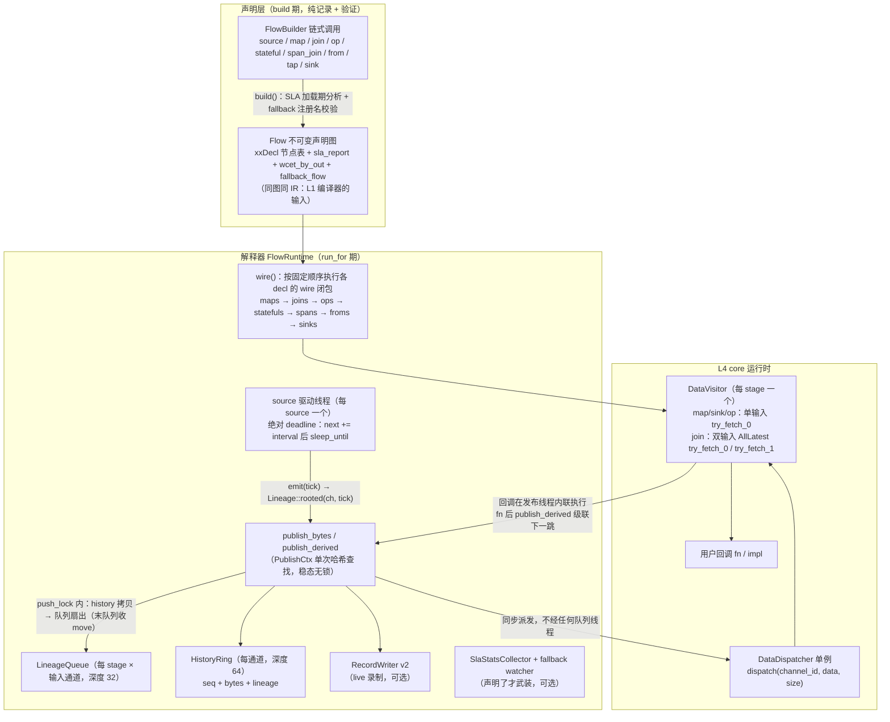
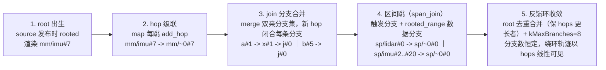

# 声明式 DSL 与血缘（`tianshu/dsl`）

> 状态：✅ 已实现（Phase 1：DSL v0 + 血缘 + 切片 + 状态 + record v2 + fallback 阶梯 v0）——写 flow 声明数据依赖与算子语义，`build()` 即完成 SLA 加载期验证，`FlowRuntime` 解释执行于 L4 栈上，逐消息血缘自动级联、逐消息可录可放。
> 代码：`tianshu/include/tianshu/dsl/`（`flow.h` 声明层 · `dsl_runtime.h` 解释器 · `record.h` v0 遗留 · `record_v2.h` 流式记录）· `tianshu/src/{dsl_runtime,record,record_v2}.cc`
> 关键 ADR：[ADR-0021 DSL v0](../../adr/0021-dsl-v0.md) · [ADR-0022 Lineage v0](../../adr/0022-lineage-v0.md) · [ADR-0024 op 原语](../../adr/0024-dsl-op-primitive.md) · [ADR-0025 from() 组件引用](../../adr/0025-from-component-reference.md) · [ADR-0026 切片输入模型](../../adr/0026-slice-input-model.md) · [ADR-0027 状态即数据](../../adr/0027-state-as-data-channel-taxonomy.md) · [ADR-0028 Record v2](../../adr/0028-record-format-v1.md) · [ADR-0031 降级阶梯](../../adr/0031-fallback-degradation.md)
> 测试：`tests/dsl/`（6 文件：`dsl_test.cc` · `sla_test.cc` · `slice_state_test.cc` · `record_v2_test.cc` · `runtime_coverage_test.cc` · `flow_fallback_test.cc`）· 示例：`examples/{dsl_demo,lidar_imu_demo,full_chain_demo,record_replay_demo,state_recovery_demo,traceable_flow_demo}.cc` + 设备库 `examples/{avp_devices.cc,avp_types.h}`
> 最后同步：2026-09-10 · commit `c8ed440`

---

## 1. 职责与边界

**做什么**：

- **声明式图 API**：`FlowBuilder` 链式声明（`source` / `map` / `map_to` / `join` / `op` / `stateful` / `span_join` / `from` / `tap` / `sink`），`Stream<T>` 强类型边让接线错误成为编译错误；`build()` 产出**不可变** `Flow` 声明图（自描述 `SourceDecl`/`MapDecl`/`JoinDecl`/`OpDecl`/`StatefulDecl`/`SpanDecl`/`FromDecl`/`SinkDecl` 节点表）。
- **解释执行**：`FlowRuntime` 把声明图装配到 L4 栈——source 直驱 `DataDispatcher`（不经 transport），一次 publish 在同一调用栈内同步贯通全链；每个 source 一个驱动线程，绝对 deadline 节奏。
- **逐消息血缘级联**：`Lineage` 值对象（本体在 `tianshu/core/lineage.h`）由 DSL 运行时全自动追加 / 合并——用户唯一可见点是 sink 签名 `fn(const T&, const Lineage&)`。分支模型承载 DAG 出处，区间跳承载切片出处，root 去重承载反馈环。
- **切片输入**（ADR-0026）：`span_join` 触发对齐物化 `Slice<T>`（有界历史环为基底）；在线（内存环）与离线（record 文件 + `replay_from`）是同一查询语义的两个基底——离线 == 在线。
- **状态即数据**（ADR-0027）：`stateful` 双发布句柄把每次状态更新发布为带版本、带血缘的消息；恢复协议 = 取 checkpoint 状态 + 其血缘定位吸收点 + 只重放后缀输入（EXACT MATCH）。
- **记录与回放**：record v2（`.trec`）流式落盘——live 录制挂进 publish 热路径，血缘二进制入库（引用通道字典 compact ID）、chunk 级 LZ4/ZSTD 压缩、索引 + 统计 + footer 自包含；`replay_from` 重发记录消息，级联与血缘精确重建。
- **SLA 挂载点**：`with_sla(sla::Sla)` 端点声明 + `with_wcet` 预算声明在 build 期喂给 `sla::SlaAnalyzer`（[ADR-0029](../../adr/0029-sla-compilation.md)）；`wire()` 按端点武装 `SlaStatsCollector` 运行期直方图。
- **降级阶梯 v0**（ADR-0031）：`with_fallback(name)` 声明降级目标流（加载期校验），运行期 watcher 采样 SLA miss 计数器产生降级信号（`fallback_state()`），v0 不热切换。
- **可追溯流注册表**：`REGISTER_TRACEABLE_FLOW(name, fn)` 静态初始化注册；`build_registered_flow(name)` 按名构建——**build 即 dry-run trace**（SLA 跑了、图物化了），是 `ti launch` 与 L1 编译管线（ADR-0030 M-D）的入口。

**不做什么**：

- **不做 L1 编译**：codegen 是 [ADR-0030](../../adr/0030-l1-compiler.md) 的主战场。**解释执行与 L1 编译的边界是"同图同 IR"**——`Flow` 声明图就是编译器的 IR 输入（`IrGraph::from_flow(flow)` 直接消费），解释器只是这个 IR 的第一个消费者；`wire()` / `run_sources()` 刻意拆开，让编译产物安装自己的特化 wiring 后驱动同一个 run loop（见 `traceable_flow_demo.cc` 的 `Pipeline::compile` → `compiled.run(runtime, flow, ...)`）。
- **不做调度与传输**：复用 core 的 `DataDispatcher` / `DataVisitor` / `Component` 体系；解释器主路径零 transport 依赖（`from()` 桥除外，走 INTRA 泵回）。
- **不承诺并行度**：v0 单线程同步级联语义（每条链在其 source 线程内贯通）——并行化是 L1 编译器 + SLA 规划（L3）的事；解释器 benchmark 结论不外推到编译产物。
- **不做 fallback 热切换**：v0 只产生信号（事件计数 + 最后违规端点）；停源、排空、按名重建 fallback 流的 runtime 属 v1（需 quiesce 语义配合，单独评审）。
- **不做消息格式**：类型擦除点只有 `MessageTraits<T>`（POD 即 memcpy），FlatBuffers/Protobuf 随 [ADR-0008](../../adr/0008-message-format-multi.md) 演进。
- **record v2 读方不认 v0/v1 legacy 文件**（magic 区分，legacy 解析路径未实现）；v0 `RecordFile` 已废弃，仅为 ADR-0026-C 验收历史保留，无生产路径链接。

## 2. 公共 API 速览

### 2.1 声明层（`flow.h`，namespace `tianshu::dsl`）

**`FlowBuilder`**（链头；通道名 = `flow名/通道名`，map/join/span 自动匿名通道 `flow名/~N`）：

| 方法 | 说明 |
|---|---|
| `source<T>(name, interval, emit)` | 定时源（传感器替身）：每 tick 调 `emit(tick)` 产一条 `T`，血缘 rooted |
| `join<TA, TB, TC>(chainA, chainB, fn)` | AllLatest 融合：两输入皆非空才触发、各消费一条；输出匿名通道，血缘合并双亲分支 |
| `op<TIn, TOut>(chain, out_name, impl)` | 自定义算子（ADR-0024）：`impl.on_init(OpPub<TOut>&)` 装配期自举 + `impl.handle(const TIn&, OpPub<TOut>&)` |
| `stateful<TOut, TState>(chain, out_name, state_name, impl)` | 状态算子（ADR-0027）：双发布句柄；`on_init(out_pub, state_pub)` / `handle(in, out_pub, state_pub)`，两路共享输入血缘为父 |
| `span_join<TOut>(trig, data, span_fn, time_fn, impl)` | 触发对齐切片（ADR-0026）：`span_fn(trig) → [t0, t1]`，`time_fn(msg)` 取消息时间，框架物化 `Slice<TData>` 后调 `impl(trig, slice)` |
| `tap<T>(name)` | 纯句柄声明（不声明生产者）——反馈图断环：join 可先引用端口，写它的 op/from 稍后构造 |
| `from<TOut>(registry, out_name, interval)` | 引用注册的 `TimerSourceComponent<TOut>`（源型驱动；interval 由 flow 声明） |
| `from<TIn, TOut>(registry, chain, out_name)` | 引用注册的 `Component<TIn, TOut>`（读写型；输入 = chain 通道，输出通道注入） |
| `from<TOut>(registry, chain0, chain1, out_name)` | 引用注册的 `TwoInputComponent<TIn0, TIn1, TOut>`（双输入，ADR-0025 修订；双队列血缘配对 + 分支合并） |
| `with_sla(string_view)` | 接受并忽略（v0 兼容槽；真声明走 `FlowChain::with_sla(sla::Sla)`） |
| `with_sla_config(sla::SlaConfig)` | 覆盖 SLA 分析配置：默认 WCET / hop cost / `machine_cores` / `margin` / `strict_utilization` |
| `with_fallback(flow_name)` | 声明降级目标（ADR-0031）：`build()` fail-fast 校验——目标须已注册且不允许自引用 |
| `build()` | 产出不可变 `Flow`（SLA 加载期分析 + fallback 校验在此执行；违规 throw） |

**`FlowChain<T>`**（链句柄；持有 builder 裸指针，链式表达式须为一条完整语句——v0 约束，拆链需保活 builder）：

| 方法 | 说明 |
|---|---|
| `map<TOut>(fn)` | 纯函数级联，自动匿名通道 |
| `map_to<TOut>(out_name, fn)` | 显式输出通道的 map——反馈写回边（写别人也 join 的通道） |
| `with_sla(sla::Sla)` | 端点语义（ADR-0029 D1）：deadline 绑定当前链通道，build 期验证最坏上游路径 |
| `with_wcet(std::chrono::microseconds)` | 声明产出该通道节点的 WCET（ADR-0029 D2；未声明节点吃默认值并被点名） |
| `with_fallback(flow_name)` | 同 builder 版本（链上任一位置声明均可） |
| `sink(fn)` | 终端回调 `fn(const T&, const core::Lineage&)` |
| `build()` / `valid()` | 结束声明 / 检查 `from()` 失败产物（未注册名或形状不匹配 → invalid chain，下游自然 no-op） |

**`Flow`**（不可变声明图）：`sources()/maps()/joins()/ops()/statefuls()/spans()/froms()/sinks()` 节点表访问 · `sla_report()`（budgets / violations / `saturation_warning` / `default_wcet_notes`）· `sla_endpoints()` · `wcet_by_out()`（编译器 IR 输入，ADR-0030 D2）· `fallback_flow()` · `describe()`（`"src[...] map[a -> b] join[a + b -> c] op[...] stateful[...] span[t x d -> o] from[...] sink[...]"` 汇总串）。

**`Slice<T>`**（切片视图，ADR-0026）：`items`（物化成员）· `seq_lo` / `seq_hi`（闭区间；lo > hi 即空）· `truncated`（历史环深不足丢弃了区间头部）· `empty()`。

**注册表**：`REGISTER_TRACEABLE_FLOW(name, fn)`（静态初始化落入无锁侵入式链，零分配零抛出）· `registered_flow_names()` · `build_registered_flow(name)`（未知名 throw `std::invalid_argument`）。

### 2.2 解释器与记录（`dsl_runtime.h`，`FlowRuntime`）

| 方法 | 说明 |
|---|---|
| `run_for(flow, duration)` | `wire(flow)` + `run_sources(flow, duration)`：装配 → 自举钩子 → 驱动全部 source 至时长耗尽 |
| `wire(flow)` / `run_sources(flow, duration)` | 拆开的装配半程 / 运行半程——编译产物（ADR-0030）装自己的 wiring 后复用同一 run loop |
| `publish_bytes(channel, data, size, lineage)` | 血缘扇出到全部消费者队列 + 历史环捕获 + 同步 dispatch；rvalue 重载把血缘 move 进最后一个目的地（热路径省一次深拷贝） |
| `history(channel)` | 通道有界历史（`(seq, bytes, lineage)` 最旧在前；从未发布返回 `nullptr`）——切片查询与状态恢复的在线基底 |
| `sla_snapshot()` | 运行期 SLA 端点直方图与 miss 计数（未声明端点的流恒为空——零开销） |
| `fallback_state()` | 降级信号：`FallbackState{declared, events, last_endpoint, last_miss_count}` |
| `start_recording(path, compression = kLz4)` / `stop_recording()` / `is_recording()` | record v2 live 录制：挂进 publish 路径，逐消息带 ts / 血缘 / 通道 schema（首发自动注册通道） |
| `record_to(path)` | **已废弃**（v0 单发 dump，ADR-0026-C 历史）；生产路径用 v2 live 录制 |
| `replay_from(records)` | 按记录序重发消息——级联与血缘精确重建（切片查询的离线基底） |
| `OpPub<T>::publish(msg)` | op/stateful 发布句柄：handle 内 = 输入血缘 + hop（map 语义）；on_init 内 = rooted（source 语义）；**仅在 on_init/handle 调用期间有效** |

### 2.3 record v2（`record_v2.h`，namespace `tianshu::dsl::record`）

| 类型 / 函数 | 说明 |
|---|---|
| `Compression` | `kNone` / `kLz4` / `kZstd` |
| `RecordWriter(path, compression)` | 流式追加：`add_channel(name, format, type_name, schema_blob)`（紧凑 ID 从 0 连续分配）· `append(id, seq, ts_ns, data, size, lineage*)`（chunk 攒批：500 条或 1 MiB 触发 flush）· `flush_chunk()` · `finish()`（写字典 + 索引 + 统计 + footer，回填 128B header） |
| `RecordReader` | `open(path)`（header/footer 校验，失败 `nullopt`）· `channels()` / `find_channel(name或id)` · `next(RecordedMessageV2*)`（ts 序顺序读）· `seek(ts_ns)` · `read_range(channel_id, ts_lo, ts_hi)` · `stats()`（O(1) 读统计段）· `chunk_index()` · `major_version()` |
| `RecordReader::merge(inputs, output)` | 分片合并：字典合并（重编 ID）+ 消息按 ts 归并 |
| `RecordReader::split_by_time(input, output, ts_lo, ts_hi)` | 按时间切（闭区间） |
| `serialize_lineage(lin, id_for)` / `deserialize_lineage(blob, name_for)` | LineageRecord 二进制序列化：分支 / root / hop / 区间跳，通道名引用字典 compact ID |
| `RecordedMessageV2` | `channel_id` · `seq` · `ts_ns` · `payload` · `lineage`（`optional<Lineage>`） |
| `ChannelEntry` / `ChunkIndexEntry` / `RecordStats` | 字典条目（含 `schema_blob` 与统计回填字段）/ chunk 索引条目 / 文件级统计 |
| `crc32(data, size, seed)` | CRC32（IEEE 802.3，表驱动）——header/footer/chunk/dict 校验共用 |
| `RecordFile` / `RecordedMessage`（`record.h`） | **DEPRECATED** v0 格式（`'TREC0001'` magic，血缘存 describe 文本）；仅存于 ADR-0026-C 验收历史 |

### 2.4 真实声明片段（摘自 examples）

```cpp
// 来源：examples/full_chain_demo.cc（节选）
tianshu::dsl::FlowBuilder builder("avp");

// 注册驱动（ADR-0025）：flow 只点名注册名 + 通道 + 节奏，
// 实现住在设备库 examples/avp_devices.cc（四个 TIANSHU_REGISTER_COMPONENT）
auto radar_front = builder.from<RadarMsg>("avp.radar.front", "radar/front", std::chrono::milliseconds(20));
auto radar_rear  = builder.from<RadarMsg>("avp.radar.rear", "radar/rear", std::chrono::milliseconds(25));
auto gnss        = builder.from<GnssMsg>("avp.gnss", "gnss", std::chrono::milliseconds(100));

auto fused       = builder.join<RadarMsg, RadarMsg, ObstacleList>(radar_front, radar_rear, fuse_fn);
auto perception  = builder.join<ObstacleList, GnssMsg, PerceptionOut>(fused, gnss, perceive_fn);
auto prediction  = perception.map<PredictionOut>(predict_fn);

// 断环端口：planning 先引用 chassis 通道，写它的组件稍后才声明（反馈边）
auto chassis_port = builder.tap<ChassisState>("chassis");
auto plan    = builder.join<PredictionOut, ChassisState, Plan>(prediction, chassis_port, plan_fn);
auto control = builder.join<Plan, ChassisState, ControlCmd>(plan, chassis_port, control_fn);

// 底盘 = 注册读写组件：init() 上电报文经桥点燃反馈环，无需种子源
auto chassis = builder.from<ControlCmd, ChassisState>("avp.chassis", control, "chassis");
```

## 3. 内部设计

### 3.1 声明如何落到 L4 DataDispatcher



### 3.2 一条消息的血缘演化



### 3.3 机制要点

- **同步级联**：source 线程内一次 `publish_bytes` → `DataDispatcher::dispatch` → 下游 `DataVisitor` 回调在同一调用栈内联执行 → 逐级 `publish_derived` 直到 sink。v0 的正确性（血缘弹出序 = 消费序、每通道单写者）与简单性都系于此；并行度留给 L1。例外是**反馈通道**（`map_to` 写回）：种子源线程与载环级联线程并发写同一通道，故 `PublishCtx` 持 per-channel `SpinLock` 保护 history/队列 push 段（单写者通道只付一次无竞争 acquire）。
- **两阶段 lambda 装配**：`detail::make_*` 装配闭包在 `flow.h` 里只有前置声明（彼时 `FlowRuntime` 不完整），定义在 `dsl_runtime.h` 中类完整之后——lambda 内的成员访问保持依赖表达式，绕开两阶段查找对完整类型的要求。`Flow` 的各 decl 携带类型擦除的 `wire(FlowRuntime&)` 闭包，运行时按固定顺序遍历执行；同一机制让编译产物能跳过 `wire()` 直接安装特化 wiring 再复用 `run_sources()`。
- **绝对 deadline 源节奏**：`drive_source` 维护 `next = start + interval` 累加并用 `sleep_until`——无累计漂移（与 L4 `TimerComponent` 同纪律）。
- **每消费者血缘 mailbox**：`register_lineage_queue` 为每个 (stage, 输入通道) 建深度 32 的 `LineageQueue`；`publish_impl` 在 `push_lock` 内先拷贝进 history，再把血缘扇出到全部注册队列——**最后一个队列收 move**（rvalue publish 路径），无消费者时 history 收 move。多消费者互不偷取（v0 单 FIFO 的缺陷已在 v0.5 解除）。
- **root 去重合并 + kMaxBranches**：`Lineage::merge` 对同 root channel 的分支只留一条——保留 hops 更长者（环上回来的分支更新鲜）；分支上限 `kMaxBranches = 8` 兜底。闭环中分支数恒定（`full_chain_demo` 稳定 4：radar/front、radar/rear、gnss、chassis），绕环轨迹以 hops 线性增长并可见。
- **span 触发物化**：trigger 通道的 visitor 在触发线程内对数据通道 `HistoryRing` 做**持锁遍历**（`for_each_entry`——数据通道源线程并发 push，无锁遍历曾是 map 重分配 use-after-free，CI asan 抓获后修复），`time(msg) ∈ [t0, t1]` 的条目 POD memcpy 进 `Slice.items`；`truncated` 由最旧保留条目的时间是否晚于 `t0` 判定。输出血缘 = 队列弹出的触发父分支 `merge(rooted_range(data, seq_lo, seq_hi))`——19 个父一条分支；**空切片省略区间分支**。
- **状态即数据与恢复协议**：`attach_stateful` 的两个 `OpPub`（输出 + 状态）共享同一次弹出的输入血缘为父——状态版本 `state#k` 的血缘精确指向产出它的那条输入（`"ev#k -> acc#k"`）。恢复：从状态通道历史（或 record 文件）取 checkpoint，其 `lineage.root().seq` 即已吸收输入位置，**只重放其后缀输入**，终态与不间断运行 EXACT MATCH（`state_recovery_demo` / `slice_state_test.cc` 双验证）。
- **在线/离线同 API**：在线基底 = 内存 `HistoryRing`（深度 64，`(seq, bytes, lineage)` 条目、payload 走 `SmallVec<uint8_t, 32>` 内联）；离线基底 = record 文件。`replay_from` 只重发**源通道**消息，中间通道经级联重算——sink 输出与血缘逐字节一致（demo 39/39 bit-identical）。
- **record v2 写读路径**：append 攒批 → flush 时 chunk 内按 ts 排序 → 压缩（LZ4 默认 / ZSTD level 3 / None）→ 带 CRC 与 `ts_first/ts_last` 的 chunk 记录；`finish()` 依序写字典（含 schema blob 槽位）→ chunk 索引 → 统计 → 64B footer，再回填带 CRC 的 128B header（占位先写，保证数据从 offset 128 起）。live 录制经 `PublishCtx.recorded` 挂进 publish 热路径：通道首发自动 `add_channel`，消息 seq 取 `own_seq_of(lineage)`（首分支末跳或 root），录制器锁独立于运行时锁。
- **发布热路径优化（ADR-0030 D8 落地）**：`PublishCtx` 把 channel_id / 队列表 / history 指针 / 录制通道一次性解析为写时复制快照（稳态一次原子 load + 一次哈希，无运行时锁）；`publish_derived` **按值收父血缘**——move 进来、`add_hop` 原位追加、末次 publish 再 move（否则每消息 O(hops²) 拷贝）；`Lineage` 分支 inline 容量 2、hops inline 容量 4（线性链与 join 拷贝零堆分配）。
- **fallback 阶梯判定与降级语义（ADR-0031，以代码为准）**：`build()` 时 `with_fallback` 目标名必须命中注册表（`detail::is_registered_flow`）且不许自引用，否则 throw；`IrGraph::fallback_flow()` 随 `export_conf()` 输出 `fallback_flow = "..."`（旧产物缺字段 = 无 fallback，向后兼容）。运行期：仅当声明了 fallback **且** SLA 端点已武装时起 watcher 线程，每 20ms 采样一次 miss 计数器，任一端点单窗口 miss 增量 ≥1 即计一次降级事件（`events`++，记 `last_endpoint` / `last_miss_count`）；无 fallback 声明的流零新增开销。**v0 只信号不接管**——热切换（停源、排空、按名重建 fallback 流）是 v1。
- **from() 桥（ADR-0025 三问三答）**：输入驱动组件的 `proc` 在发布者 dispatch 线程内联执行（与 map/join 同模型）；定时组件自带线程。装配期 `launch(node, 输入通道, interval)` + `set_out_channel_override`（输出通道注入，一个驱动类服务多实例）；`init()` 推迟到 `init_hooks_` 阶段——全部消费者队列注册后才发布上电报文，反馈环自然点火。输出经 INTRA reader 泵回：**血缘边界 = "同步派生 vs 异步发布"**——`set_input_lineage_provider` 装的 mailbox 与组件 FIFO 消费逐条配对，`proc` 内 publish 携带父血缘经 `Message.lineage_ptr` 过桥派生（环跨组件边界展开）；init 期发布与无 provider 的组件仍 rooted。双输入形态（2026-09-10 修订）：每消费一对 `(msg0, msg1)` 从**两个队列各弹一条并 merge**——与 DSL join 同 provenance 规则。`run_sources` 返回前对全部引用组件 `quiesce()`（定时线程 join、在飞级联排空），teardown 不与运行中的回调竞争。

## 4. 与其它模块的关系

- **core（dispatcher / visitor / component / lineage / traits）**：DSL 是 `DataDispatcher` + `DataVisitor` 的直接消费者——`publish_bytes` 以 `core::channel_id_for(channel)` 派发，各 stage 一个 visitor（队列深度 `kQueueDepth = 16`）；`from()` 消费 `ComponentFactory` / `Component` / `TwoInputComponent` / `TimerSourceComponent` / `Node`；`Lineage` 值对象与 `MessageTraits<T>`（`TIANSHU_TRAITS_POD` 类型名）住在 core，本模块负责其级联语义。
- **transport**：解释器主路径不经 transport；`from()` 桥以 `core::Node(kIntra)` + `transport::ReaderBase` 泵回组件输出，血缘指针经 INTRA 臂随行（SHM 臂丢弃——跨进程血缘序列化是 Phase 2 演进，见 [modules/transport.md](./transport.md) §4）。
- **sla**：`build()` 把声明图降维成 `SlaSource` / `SlaNode`（含双输入 from 的双输入通道）喂 `SlaAnalyzer::analyze`，违规 throw；`wire()` 按端点武装 `SlaStatsCollector`，`sla_snapshot()` 供运行期直方图；`Flow::wcet_by_out()` 同时作为编译器 IR 输入。
- **compiler（IR 供给）**：`IrGraph::from_flow(flow)` 消费同一张 `Flow`（节点 / 通道 / 类型 / WCET / fallback 名），`export_conf()` 产出 `.conf`；`REGISTER_TRACEABLE_FLOW` 注册表让 `ti launch` 与 `Pipeline::compile` 按名构建——**同图同 IR** 是解释器与编译器可互换的保证。
- **base**：`SmallVec`（血缘分支/hops/历史条目内联）与 `SpinLock`（per-channel push 锁），见 [modules/base.md](./base.md)。
- **叙事文档**：上手教程 [05-dsl-getting-started.md](../../05-dsl-getting-started.md) · 全链路 demo 讲解 [03-full-chain-demo.md](../../03-full-chain-demo.md) · 数据模型一般化 [04-data-model-generalization.md](../../04-data-model-generalization.md)（本文只链接不复述）。

## 5. 设计决策与被否方案

| # | 决策 | 被否方案与理由 | 出处 |
|---|---|---|---|
| 1 | **DSL v0 = builder 记图 + 解释器同步级联**；FlowDecl 字段即 IR 子集，`with_sla` 预留槽 | ① codegen 路线：L1 编译器是 Phase 2 目标，Phase 1 需要 DSL 立即可跑验证 H1；② pull-based（Reactive/Flink 式拉取）：与 L4 推送式 Dispatcher 语义相反，传感器流推送是正解。v0.5 增补 join（AllLatest）并解除单消费者约束 | [ADR-0021](../../adr/0021-dsl-v0.md) |
| 2 | **血缘 = 旁路 side-car 值对象**（root + hops）；v0.5 升级分支模型 + 每消费者队列；v0.5.1 反馈环 root 去重（保 hops 更长者）+ `kMaxBranches = 8` | ① in-band 消息内嵌：侵入所有消息格式（POD 布局 / proto / fbs 都要加字段），SHM 指针序列化复杂；② 全局日志按时间戳对齐：对齐概率性、重建昂贵、实时查询做不到；③ 单 FIFO：多消费者互相偷取（风险表预言的首项，join 落地时兑现） | [ADR-0022](../../adr/0022-lineage-v0.md) |
| 3 | **op 原语**（初稿名 `box`，定名 op）：`on_init(pub)` 自举反馈环 + `handle(in, pub)` 变换；血缘 handle=map 同构 / on_init=source 同构；0 输入不归 op 管 | 被否名：`block`（实时框架里第一联想是"阻塞"）、`actor`（与 AD 领域 traffic actor 冲突）；`model`（NN 推理歧义）——定名执行 ADR-0002 术语分层（L1 = Operator）。被否方案：维持 seed 源 + `map_to` 组合（幽灵状态注入是正确性缺陷）；直接引用 ComponentFactory（留待 ADR-0025 单独设计）。生命周期先例：Kafka Streams Processor `init/process/forward` ↔ `on_init/handle/publish` | [ADR-0024](../../adr/0024-dsl-op-primitive.md) |
| 4 | **from() 组件引用**：线程归属不夺组件执行模型 / launch 对齐装配期、init 推迟到全图就绪 / intra reader 泵回；输出通道注入 `set_out_channel_override`；形状校验 `dynamic_cast`（RTTI 受限使用的注册表例外） | 血缘边界初稿"组件是黑盒故整体 rooted"——**评审否决**：正确边界是"同步派生 vs 异步发布"，`proc` 由框架同步驱动，父血缘配对确定性成立（`Message.lineage_ptr` 落地）。被否词汇：`source_from` / `box_from` 并列两词（M×N 词汇膨胀，废弃——引用机制只作用于实现来源轴，一个动词足够）。2026-09-10 修订：双输入 `TwoInputComponent` 引用（双队列各弹一条 + branch merge） | [ADR-0025](../../adr/0025-from-component-reference.md) |
| 5 | **切片输入 = trigger + fetch**：map/join 是退化形态保留为语法糖；区间跳压缩多父（`imu#102..#121`，完整成员表按 (channel, seq-range) 可查）；在线/离线同 API 两个基底 | AllLatest 扩展（各取最新表达不了"一帧雷达要全部区间内 IMU"）；stage 一般化 API 面膨胀风险以"退化关系引导"缓解。Phase A/B/C 全部落地（C = record 基底，39/39 bit-identical） | [ADR-0026](../../adr/0026-slice-input-model.md) |
| 6 | **状态即数据 + 通道分类学**：状态通道带版本带血缘；连续/快照两档诚实分层写放大；有名 = 契约边界（编译器不得动）、匿名 = 可优化边界（kernel fusion 法律基础）；恢复 = state#k + 后缀重放；算子是面 | 状态藏在算子内部变量（血缘不可见，只能全量重放——精确但昂贵）；`v0` 自动匿名通道由分类学获得设计正当性（不只是"用户没起名"，而是声明该接线不构成契约） | [ADR-0027](../../adr/0027-state-as-data-channel-taxonomy.md) |
| 7 | **record v2**：血缘二进制入库（LineageRecord 引用字典 ID）、chunk 级 LZ4/ZSTD、分片/合并为文件级原生操作、schema blob 嵌入字典、双路径（回放选级联重建——快；分析选文件读取——不跑图） | v1 草案"不存血缘"被评审否决：离线审计需要不跑图读出血缘，文件里的血缘是权威记录；v0 单发 dump 被取代（无 live、无压缩、无索引）。与 MCAP/rosbag2 对比：血缘存储、POD schema、格式级保时序为本格式独有 | [ADR-0028](../../adr/0028-record-format-v1.md) |
| 8 | **fallback 阶梯 v0 = 声明 + 加载期校验 + 运行期信号，不做热切换**；阈值 20ms 窗口 / miss 增量 ≥1 为编译期常量 | 热切换（v1）：正确性依赖"排空再重建"，lineage 连续性与状态恢复都要新协议，风险集中一次交付不可控；信号本身已闭环可用（ti monitor / 测试可驱动外部决策）。不做 fallback 链环检测：按名校验已排除未知名与自引用，跨流环到 v1 热切换才有运行期意义。阈值不提升为配置项：避免过早配置面 | [ADR-0031](../../adr/0031-fallback-degradation.md) |

## 6. 测试 / 示例入口

**测试**（`tests/dsl/`，随 CMake `ctest --test-dir build/desktop` 与 Bazel `bazel test //...` 全量运行）：

| 文件 | 覆盖 |
|---|---|
| `dsl_test.cc` | 图形状与 describe 精确串；级联值 + 血缘链逐字节；join 分支合并格式；同通道双 sink 全量可见（每消费者队列）；闭环反馈收敛 + 分支有界 + 绕环 hops 可见；op 生命周期血缘（on_init 根 / handle 派生精确串）；op 无种子源自举闭环；from()（未注册 / 形状不匹配 → invalid、驱动 rooted 流、组件 init 自举、组件派生血缘跨边界展开、双输入融合 + 分支合并 + 双输入形状不匹配）；traceable-flow 注册表（按名构建 == 直接构建、未知名 throw） |
| `sla_test.cc` | 加载期：可满足链按 WCET 比例分摊预算、超限 throw 附违规路径与 worst offender、join 取关键分支、饱和先警告后 strict 拒载、未声明 WCET 点名、无端点不分析；运行期：直方图 e2e、sleep 越限全 miss、collector 分桶 / 非端点 no-op、未声明零武装 |
| `slice_state_test.cc` | 区间跳渲染与合并；通道历史有界捕获（64 深、seq/bytes 往返）；stateful 每输入一版状态 + 血缘精确指向；快照恢复 = checkpoint@59 + 后缀重放 EXACT MATCH；span 物化 19 条成员 + 区间分支精确串；空切片省略区间分支 |
| `record_v2_test.cc` | CRC32 标准向量；lineage 序列化往返（含区间跳）；写读 round-trip（字典 / 统计 / ts 保序 / 血缘在场）；LZ4 压缩往返；split_by_time；merge（同通道归并 + 字典合并）；空文件 |
| `runtime_coverage_test.cc` | live 录制生命周期（start/stop/double-stop）；stateful + span 经 `run_for` 全路径；未注册 from() 装配为 no-op 不崩不挂 |
| `flow_fallback_test.cc` | 声明与携带（`fallback_flow()`）；默认无；未知名 / 自引用 build throw；运行期持续 miss 触发降级事件（events ≥ 1 + 最后违规端点）；健康流零事件；IR 往返（`IrGraph::fallback_flow()` + `.conf` 导出含 `fallback_flow = "..."`）；无声明不武装 watcher |

**示例**（`examples/`）：

| 示例 | 一句话 |
|---|---|
| `dsl_demo.cc` | README 一句话 API 的实跑版：source→map→map→sink + `with_wcet` / `with_sla`，打印 SLA 报告、运行期直方图与逐消息血缘链 |
| `lidar_imu_demo.cc` | 10Hz lidar × 200Hz IMU 运动补偿——AllLatest 表达不了的典型 span 形态，每帧恰好 19 条 IMU 样本，血缘逐帧区间推进 |
| `full_chain_demo.cc` | 感知→预测→规划→控制→底盘反馈闭环：`from()` 设备库 + 双雷达 join + `tap` 断环 + 底盘组件 init 点火，速度收敛目标带 |
| `record_replay_demo.cc` | v2 live 录制 → fresh runtime 回放（只重发源通道，中间通道级联重算），输出逐字节一致——离线 == 在线 |
| `state_recovery_demo.cc` | 状态即数据恢复：checkpoint 血缘定吸收点 + 后缀重放，恢复终态与不间断运行 EXACT MATCH |
| `traceable_flow_demo.cc` | `REGISTER_TRACEABLE_FLOW` 注册 → 按名 dry-run trace → `IrGraph` 规范化哈希与 fallback 阶梯 → `Pipeline::compile` 编译产物运行（含降级事件打印） |
| `avp_devices.cc` + `avp_types.h` | 注册设备库（双雷达 / GNSS / 底盘四个 `TIANSHU_REGISTER_COMPONENT`）：写一次，任何 flow 按名 `from()` 引用 |

叙事讲解：全链路 demo 与设备库的演进故事见 [03-full-chain-demo.md](../../03-full-chain-demo.md)；切片 / 状态 / 记录回放的数据模型里程碑见 [04-data-model-generalization.md](../../04-data-model-generalization.md)；DSL 上手教程见 [05-dsl-getting-started.md](../../05-dsl-getting-started.md)。

## 7. 已知限制与演进方向

- **解释器 ≠ 编译产物**：v0 只验证语义与 H1 链路，性能结论不外推；L1 codegen（[ADR-0030](../../adr/0030-l1-compiler.md)，H2 验证门 P99 < 1%）是当前主战场——`Flow` IR 与 `wire()`/`run_sources()` 拆分已为其备好接口。
- **fallback 热切换（v1）**：停源、排空（quiesce 语义）、按名重建 fallback 流的 runtime；届时一并处理 fallback 链环检测（A→B→A）与阈值配置化。
- **`FlowChain` 持 builder 裸指针**：链式表达式必须是单条完整语句（临时 builder 的生命期即链条）；跨语句拆链需用户保活 builder——v0 已记录的约束。
- **血缘**：单分支 hops 随环迭代线性增长（超长运行需 Phase 2 深度上限截断，根保留）；跨进程（SHM 臂）`lineage_ptr` 丢弃，随行序列化是 Phase 2 演进。
- **切片**：`kHistoryDepth = 64` 固定（fetch 声明最小深度需求 + 装配期校验未做，深度不足只能 `truncated` 标记）；`last_n` / `window` fetch 未实现（只有 `span`）；高频触发 × 大切片的合并策略 v1 从简（逐触发）。
- **stateful**：状态通道有意不进 v0 SLA 分析（恢复簿记，非数据路径契约）；跨进程恢复（kill -9 + SHM checkpoint）为后续。
- **record v2**：chunk 索引的通道位图暂写全通道（per-chunk 精确位图 TODO）；`read_range` 仍是顺序扫描（真索引随机读依赖 message index type 0x05，未写）；metadata（0x04）/ dict patch（0x07）/ shard link（0x08）/ ts correction（0x09）预留未实现；全文件 CRC 推迟 v2.1；v2 reader 不认 v0/v1 legacy magic；回放 wallclock pacing（`replay(rate=1.0)`）未实现（当前 max-speed）。
- **多端口 op**：多输入（AllLatest）/ 多输出（typed `OpPub` 元组返回）语义已在 ADR-0024 锁定，按需实现；`FlowBuilder::with_sla(string_view)` 仍为接受并忽略的兼容槽。
