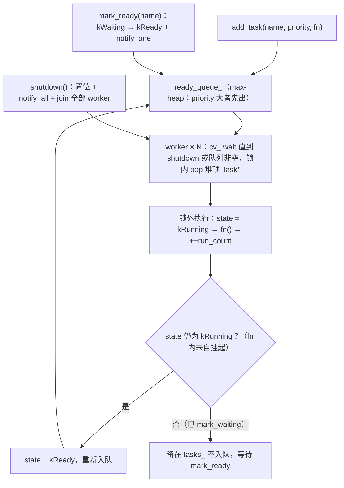

# 调度器（`tianshu/include/tianshu/sched/`）

> 状态：✅ 已实现（Phase 1，回调式）——命名任务 + 优先级 + 状态机的多线程回调调度器：N 个 worker 从共享优先级队列取最高优先级 READY 任务**运行至完成**；无协程、无抢占，时效性由「SLA 编译期验证 + 调度器优先级 + OS 线程调度」三层纵深保障（[ADR-0019](../../adr/0019-coroutine-strategy.md)）
> 代码：`tianshu/include/tianshu/sched/scheduler.h`（header-only 单文件，无对应 `src/`）
> 关键 ADR：[ADR-0019 协程策略](../../adr/0019-coroutine-strategy.md)（Phase 1 回调调度 / Phase 2 C++20 stackless） · [ADR-0018 C++ 风格指南](../../adr/0018-cpp-style-guide.md)
> 测试：`tests/sched/scheduler_test.cc`（15 用例） · 基准：- · 示例：-
> 最后同步：2026-09-10 · commit `c8ed440`

---

## 1. 职责与边界（做什么 / 明确不做什么）

**做什么**：

- 以**回调式**落地 [L4-SCHED-1..3](../../02-development-plan.md) 功能组（开发计划状态行："优先级 + 多 worker 单测通过（回调式，ADR-0019）"）。原计划的 `Scheduler` 抽象基类 / `Processor` / `SchedulerClassic` 三件套按 ADR-0019 简化为**单一具体 `Scheduler` 类**：优先级队列 + N worker。
- `Task` 模型：命名函数（`std::function<void()>`）+ `int` 优先级（大值 = 高优先级）+ 四态状态机（kReady / kRunning / kWaiting / kDone）。
- 数据驱动唤醒挂点：`mark_ready` / `mark_waiting`——ADR-0019 多通道融合机制（数据到齐 → 组件 READY）在调度器侧的接口面。
- 运行至完成（run-to-completion）：`fn()` 一次调用整体跑完，返回后调度器选下一个任务；未自挂起的任务自动重入队循环执行。

**明确不做什么**：

- **无协程**：不使用 ucontext / 汇编 swap / C++20 coroutine（ADR-0019 Phase 1 决策）；不能从任务深层调用链 yield。
- **无抢占、无时间片**：单个 `fn()` 一旦开始不被中断；超时兜底依赖 OS 线程调度（SCHED_FIFO + isolcpus + cpuset，部署层配置，不在本模块）。
- **无 work-stealing / 多级队列**：单一共享优先级队列 + 单把互斥锁。
- **无定时 / 周期调度**：无 timer / period 概念，"循环"由跑完重入队实现。
- 不做调度策略配置（L4-SCHED-5）、choreography 固定映射（L4-SCHED-4）、优先级继承（L4-SCHED-6）、watchdog（L4-SCHED-7）——均属规划条目。
- 不做数据就绪判定：多通道融合 / 对齐逻辑属 core 的 DataVisitor + CacheBuffer；调度器只暴露状态迁移接口（该接线 as-built 尚未发生，见 §4）。

## 2. 公共 API 速览

| 类型 / 函数 | 说明 |
|---|---|
| `TaskState`（`enum class : uint8_t`） | `kReady` / `kRunning` / `kWaiting` / `kDone`；`kDone` 为预留态，当前代码无写入路径 |
| `Task` | 聚合 `name` / `priority`（int，大值优先）/ `state` / `fn`（`std::function<void()>`）/ `run_count`（uint64_t 执行计数）；`operator<` 按优先级比较 |
| `Scheduler()` | 默认构造：1 个 worker |
| `explicit Scheduler(std::size_t num_threads)` | N 个 worker；传 0 收敛为 1 |
| （拷贝构造 / 拷贝赋值） | `= delete`（线程所有权不可复制） |
| `add_task(name, priority, fn)` | 注册任务并立即入 ready 队列；**同名覆盖**（`tasks_` 按 name 索引，后写替换前写，测试 `AddTaskOverwriteSameName`） |
| `mark_ready(name)` | 仅当任务处于 `kWaiting`：置 `kReady` + 入队 + `notify_one`；任务不存在或非 waiting 均为 no-op |
| `mark_waiting(name)` | 置 `kWaiting`；设计用法是任务**在自身 fn 内自挂起**（等价于 CyberRT 协程 yield 的回调形态） |
| `start()` | 启动 N 个 worker 线程；shutdown 后可再次 start（`shutdown_` 复位为 false） |
| `shutdown()` | 置停止标志 + `notify_all` + join 全部 worker；未 start 直接调用安全；析构函数自动调用 |
| `task_count()` | 已注册任务数（含 waiting，`const` + 可变锁） |

真实用法（摘自 `tests/sched/scheduler_test.cc`）：

```cpp
// 优先级：单 worker 下高优先级先跑（PriorityFirstExecution）
tianshu::sched::Scheduler sched(1);
std::atomic<int> first_runner{0};
sched.add_task("low", 1, [&]() {
  int expected = 0;
  first_runner.compare_exchange_strong(expected, 1);
});
sched.add_task("high", 10, [&]() {
  int expected = 0;
  first_runner.compare_exchange_strong(expected, 2);
});
sched.start();
std::this_thread::sleep_for(std::chrono::milliseconds(20));
sched.shutdown();
EXPECT_EQ(first_runner.load(), 2);

// 自挂起 + 唤醒：任务跑一轮后在 fn 内 mark_waiting，
// 外部 mark_ready 重新入队（MarkWaitingAndReady）——DataNotifier 集成形态
sched.add_task("waiter", 5, [&]() {
  run_count.fetch_add(1);
  sched.mark_waiting("waiter");
});
sched.start();
// ... run_count == 1 后：
sched.mark_ready("waiter");  // 再次入队，run_count >= 2

// 循环执行：未自挂起的任务跑完自动重入队（TaskRunsMultipleTimes）
sched.add_task("recurring", 5, [&]() { counter.fetch_add(1); });
sched.start();
// 50ms 后 EXPECT_GT(counter.load(), 1)：Running → Ready → 再跑
```

## 3. 内部设计

### 3.1 调度主循环



### 3.2 TaskState 状态机

```mermaid
stateDiagram-v2
  [*] --> kReady : add_task()
  kReady --> kRunning : worker 取出（锁内置位）
  kRunning --> kReady : fn() 返回且未自挂起（重入队）
  kRunning --> kWaiting : fn 内 mark_waiting(自身)
  kWaiting --> kReady : mark_ready()（数据到齐）
  note right of kDone : 预留状态，当前代码不设置
```

机制要点：

- **存储布局**：`tasks_`（`unordered_map<std::string, Task>`）持有全部任务的稳定节点；`ready_queue_` 是存裸 `Task*` 的 `std::priority_queue`（`TaskPtrCompare` 按 `priority` 比较，大值堆顶）。map 节点地址稳定保证队列指针长期有效，也使 `add_task` 同名覆盖安全——地址不变、fn 被替换，排队中的旧指针不悬空（测试 `AddTaskOverwriteSameName`：旧 fn 永不执行）。
- **同步策略**：一把 `mutex_` 同时保护 `tasks_` 与 `ready_queue_`；`cv_` 等待谓词为 `shutdown_ || !ready_queue_.empty()`（谓词形式防虚假唤醒）；`shutdown_` 为 `std::atomic<bool>`，release 置位 / acquire 读取。
- **锁外执行**：worker 在临界区内弹出任务后**释放锁**，才置 `kRunning`、调用 `fn()`、累加 `run_count`——用户代码从不在临界区内执行。
- **重入队模型**：`fn()` 返回后若 state 仍为 `kRunning`（未被自己置 waiting）→ 回 `kReady` 重新入队，任务天然循环；若 fn 内调用了 `mark_waiting`（自身）→ 不重入队，任务停留在 `tasks_` 等 `mark_ready`——等待期间零开销（不占线程）。
- **mark_ready 守卫**：只接受 `kWaiting → kReady` 迁移——对 kReady/kRunning 任务的 `mark_ready` 是 no-op（测试 `MarkReadyOnNonWaitingTaskIsNoop`），从机制上杜绝重复入队。
- **shutdown 语义**：`notify_all` 唤醒全部 worker，等待谓词短路返回退出循环；`joinable` 检查 + `workers_.clear()` 使其幂等；未 start 直接调用安全（`ShutdownWithoutStartIsSafe`）；析构函数调用 shutdown → 线程回收 RAII 化。
- **add_task 不触发 cv 唤醒**：见 §7 限制第 1 条。

## 4. 与其它模块的关系

- **依赖（as-built）：零 tianshu 依赖**——`scheduler.h` 只 include C++ 标准库（`<atomic>` / `<condition_variable>` / `<functional>` / `<mutex>` / `<queue>` / `<thread>` 等），**不使用 [base](./base.md) 的任何原语**（未用 SpinLock/RWLock，直接 `std::mutex` + `scoped_lock`）。[base.md §4](./base.md) 中"sched 构建于 DataVisitor + CacheBuffer 之上"是 ADR-0019 的**规划视角**描述（完整机制图），以代码为准该接线尚未发生。
- **被消费（grep 验证）**：当前唯一消费者是 `tests/sched/scheduler_test.cc`；core / dsl / transport / examples / benchmarks 均未引用 `tianshu/sched/scheduler.h`——调度器是"已实现、待接线"的独立原语。
- **规划中的接线点**（ADR-0019 机制）：消息到达 → `CacheBuffer::fill` → DataVisitor 判定数据到齐 → `mark_ready(组件任务)`；TryFetch 失败 → fn 返回前 `mark_waiting(自身)`（回调等价于 CyberRT 的协程 yield）。
- **构建集成**：CMake `tests/sched/CMakeLists.txt`（`scheduler_test` 链接 tianshu 库目标，`gtest_discover_tests` 进 ctest）；Bazel `tests/sched/BUILD.bazel` + `tianshu/BUILD.bazel` 头文件目标。

## 5. 设计决策与被否方案（ADR-0019 摘要）

- **四候选与分阶段裁决**：

| 候选 | 结论 | 关键理由 |
|---|---|---|
| ucontext + CRoutine（stackful） | ❌ Phase 3+ 按需评估 | POSIX only（macOS 弃用、MCU 无）；128KB/协程栈（1000 组件 = 128MB） |
| 汇编 swap（stackful） | ❌ Phase 3+ 按需评估 | 每架构手写、维护成本高、MCU 不支持 |
| C++20 协程（stackless） | ⏳ **Phase 2** 按需引入 | 跨平台、~100B/协程；但 codegen 产物是同步函数 + promise_type 样板增复杂度 + MCU 编译器支持有限 |
| 回调调度（无协程） | ✅ **Phase 1 采用** | 最简单；全 profile 兼容（含 MCU）；零额外依赖 |

- **三层纵深保障时效性（均不依赖协程）**：层 1 SLA/RTA 编译期验证消除 80% 配置类问题（[ADR-0029](../../adr/0029-sla-compilation.md)）→ 层 2 本调度器选最高优先级 READY 任务先跑 → 层 3 OS 线程调度（SCHED_FIFO + isolcpus + cpuset 绑核）提供**任意指令级**硬件抢占。对比：协程抢占只在 yield 点生效，OS 抢占在任意指令生效且实现成本更低（内核已有，只需配置）。CyberRT 的 SchedulerChoreography 本质也靠 OS 级保证，协程只是任务包装层。
- **多通道订阅不需要协程**：组件订阅多通道经 DataVisitor + CacheBuffer + 融合策略实现，完全同步——数据到齐才 `mark_ready`，否则任务不被调度（零开销等待）。
- **工作量影响**：L4-CORO-1..4/7 全部跳过；L4-SCHED-1..3 由 7 点简化为 ~3 点；Phase 1 净减 ~8 点。
- **Phase 2 演进是并存不是替换**：Phase 2a 线程池 + 回调；Phase 2b C++20 `co_await` 扁平化 callback hell——同步组件继续用回调，异步组件可选协程。
- **风格遵循（ADR-0018）**：snake_case 函数、`kPascalCase` 枚举值、成员 `_` 后缀、`scoped_lock` RAII、类 ~107 行（上限 500）、单文件 header-only 自包含。

## 6. 测试 / 基准 / 示例入口

`tests/sched/scheduler_test.cc`，15 个用例按主题分组：

- **基本执行**：`AddTaskAndRun`（注册即跑）· `TaskCount` · `DefaultConstructor`（默认 1 线程）· `ZeroThreadsDefaultsToOne`（0 → 1 收敛）
- **优先级与并发**：`PriorityFirstExecution`（单 worker 高优先级先跑）· `MultipleWorkers`（4 worker × 10 任务全部执行）
- **状态机**：`MarkWaitingAndReady`（自挂起 + 唤醒再跑）· `MarkWaitingNonExistentIsNoop` · `MarkReadyNonExistentIsNoop` · `MarkReadyOnNonWaitingTaskIsNoop`
- **生命周期与安全**：`ShutdownStopsWorkers` · `ShutdownWithoutStartIsSafe` · `DestructorCallsShutdown`（RAII 线程回收）
- **注册语义**：`AddTaskOverwriteSameName`（同名覆盖，旧 fn 不执行）· `TaskRunsMultipleTimes`（重入队循环）

运行：`ctest --test-dir build/desktop -R scheduler_test`（CMake）或 `bazel test //tests/sched/...`（Bazel）。
基准：-（benchmarks/ 现聚焦 object_pool / shm / lineage / codegen 对比）。示例：-（examples/ 无 sched 专属示例）。

## 7. 已知限制与演进方向

- **`add_task` 不唤醒休眠 worker**：队列被抽空、全部 worker 阻塞在 `cv_.wait` 时，之后 `add_task` 的任务不会被取到，须等下一次 `mark_ready` / `shutdown` 的 notify——当前测试均"先 add 后 start"或依赖重入队保持队列非空，未暴露此间隙。缓解：动态加任务时保证随后有一次 `mark_ready`，或先 `start` 再 add。
- **`mark_waiting` 无法撤销已入队**：任务在队列中排队但未执行时被外部 `mark_waiting`，其 `Task*` 仍在堆里，弹出后照常执行一次——设计意图是 **fn 内自挂起**，外部 mark_waiting 语义弱。
- **忙循环模型**：未挂起的 ready 任务跑完立即重入队，无 backoff / period——纯计算型任务会占满 worker 核；"停车"只能靠 fn 内 `mark_waiting`（事件驱动 + 等待零开销的取向使然）。
- **单队列单锁**：N worker 争用一把 mutex + 一个全局堆，高并发下临界区是瓶颈；无 work-stealing / sharded queue。
- 同优先级无 FIFO 保证（`std::priority_queue` 非稳定序）。
- `kDone` 状态预留未实现；无 `remove_task`（覆盖是唯一替换法）；`run_count` 无对外读取接口；`task_count()` 不区分状态。
- **未接线 core**：DataVisitor → `mark_ready` 的自动唤醒链路（ADR-0019 机制图）是当前最大的待办集成。
- **演进方向**：Phase 2a 线程池 + 回调、Phase 2b C++20 `co_await`（与回调并存，[ADR-0019](../../adr/0019-coroutine-strategy.md)）；L4-SCHED-4/5/6/7/9/10（choreography / 策略配置 / 优先级继承 / watchdog / 单核协作式 / MCU 静态调度表）按 profile 与阶段渐进（[开发计划](../../02-development-plan.md)）；确定性调度 X-ED-3（去时间戳依赖，按事件序触发）。
