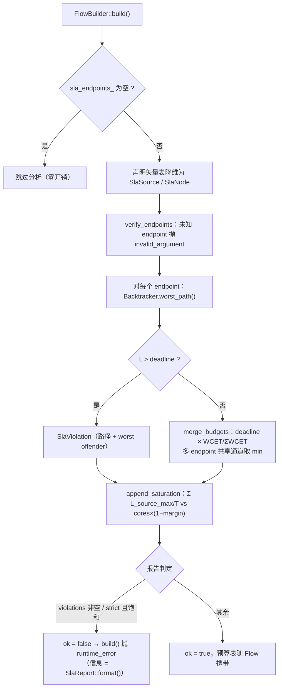

# SLA 编译（`tianshu/sla`）

> 状态：✅ 已实现 v0 + v0.5——加载期端到端 deadline 验证（两层分析 + 预算分配 + fail-fast）与运行期旁路直方图（miss 计数 / p50 / p99）均已落地；Phase 1 校准回路经 `ti-info --calibrate` 可用；固定优先级 RTA 与 fallback 热切换属 Phase 2（见 §7）
> 代码：`tianshu/include/tianshu/sla/{sla_analyzer.h, sla_stats.h}` · `tianshu/src/{sla_analyzer.cc, sla_stats.cc}`
> 关键 ADR：[ADR-0029 SLA 编译 v0](../../adr/0029-sla-compilation.md)（D1–D7 全部决策） · [ADR-0031 降级阶梯](../../adr/0031-fallback-degradation.md)（消费 miss 计数器） · [ADR-0030 L1 编译器](../../adr/0030-l1-compiler.md)（P3 pass 的 v0 降维实现）
> 测试：`tests/dsl/sla_test.cc`（10 用例，对应 ADR-0029 验收清单 1–6 + 运行期 7–10） · 示例：`examples/traceable_flow_demo.cc`
> 最后同步：2026-09-10 · commit `c8ed440`

## 1. 职责与边界（做什么 / 明确不做什么）

**做什么**：

- **类型化 SLA 声明**（D1）：`Sla{deadline}` 绑定在链末端**通道**上——deadline 属于 endpoint（通道），不属于整个 flow；一条 flow 可有多个不同 deadline 的分支。
- **层 1 链路确定性预算**（D3）：对每个 endpoint 从 trace 图回溯全部上游路径（含 join/span 汇聚），`L = max over paths ( Σ WCET + hops × c_hop )`——"线程一旦获得 CPU 就必然占用的时间"，确定性成立。
- **层 2 机器饱和度准入**（D3）：`U = Σ L_source_max / T_source ≤ cores × (1 − margin)`，Liu-Layland 式充分性检查。
- **预算下行分摊**（D4）：验证通过后 deadline 沿 DAG 按 WCET 比例分解为每算子预算表（供 monitor 展示与运行期看门狗）。
- **fail-fast 判定**（D5）：层 1 超限 → `FlowBuilder::build()` 抛 `std::runtime_error`（附完整违规路径与 worst offender）；层 2 超限默认 WARNING（图仍可运行），`strict_utilization=true` 时升级为拒载。
- **运行期防御旁路**（D6，v0.5）：`SlaStatsCollector` 在 SLA endpoint 处记录逐消息 e2e 对数直方图与 miss 计数——这是**漂移检测**（机器过载 / WCET 退化），不是 SLA 执行本身；不满足 SLA 的图本来就不该加载成功。

**明确不做什么**：

- **不做硬实时证明**：v0 执行现实是 CFS 上的线程级联（[ADR-0021](../../adr/0021-dsl-v0.md)），两层模型是诚实边界；固定优先级 RTA 是 Phase 2 静态调度落地后的升级项。
- **不做运行时 SLA 执行/降级接管**：[ADR-0031](../../adr/0031-fallback-degradation.md) v0 只产生降级**信号**（watcher 采样 miss 计数器），热切换是 v1。
- **无 SLA 声明零开销**：`FlowBuilder::run_sla_analysis` 在 `sla_endpoints_` 为空时直接返回；非 endpoint 通道的 `record_if_endpoint` 只付一次 map 查找。
- **不做 WCET 测量**：声明优先（`with_wcet`），测量校准由 `ti-info --calibrate`（H3 回路）离线提供。

## 2. 公共 API 速览

### 2.1 分析器（`sla_analyzer.h`，namespace `tianshu::sla`）

| 类型 / 函数 | 说明 |
|---|---|
| `Sla` | 类型化声明：`deadline`（`std::chrono::microseconds`，端到端：源消息到达 → 本通道产出） |
| `SlaConfig` | 分析调参：`default_wcet`（默认 100µs）· `hop_cost`（默认 20µs，保守值；实测 INTRA 同步派发 <5µs）· `machine_cores`（0 → 分析时取 `hardware_concurrency`）· `margin`（默认 0.2）· `strict_utilization`（默认 false） |
| `SlaSource` | 输入图源：`channel` · `interval`（ms；≤0 = 非周期，无 U 项） |
| `SlaNode` | 输入图节点：`kind`（`"map"` / `"join"` / `"op"` / `"stateful"` / `"span"` / `"from"`）· `in_channels` · `out_channel` · `wcet`（0 = 未声明 → 取 default 并入告警列表） |
| `SlaEndpoint` | `channel` · `deadline` |
| `SlaViolation` | `endpoint` · `deadline` · `planned` · `path`（通道序列，source…endpoint）· `worst_offender`（WCET 占比最大的算子，`"kind -> channel"`） |
| `SlaBudget` | `channel` · `planned`（关键路径上节点输出通道的预算） |
| `SlaReport` | `ok` · `violations` · `saturation_warning` · `default_wcet_notes` · `budgets` · `format()`（多行人类可读摘要，拒载错误信息即它） |
| `SlaAnalyzer::analyze(sources, nodes, endpoints, config)` | 纯函数静态分析；结构非法（endpoint 既非产出也非源）抛 `std::invalid_argument` |

分析器输入**已经类型擦除**（`SlaNode` 只有通道名与 kind），不依赖 DSL 层——dsl 与 compiler 都以矢量表喂它。

### 2.2 运行期旁路（`sla_stats.h`）

| 类型 / 函数 | 说明 |
|---|---|
| `SlaEndpointStats` | `endpoint` · `deadline` · `count` · `miss_count` · `p50` / `p99`（桶近似，对数尺度） |
| `SlaStatsCollector::add_endpoint(channel, deadline)` | 接线期注册，必须在任何 `record` 前完成 |
| `SlaStatsCollector::record_if_endpoint(channel, e2e)` | 热路径：非注册 endpoint 一次查找即返回；桶计数全 `relaxed` 原子，源级联线程零争用 |
| `SlaStatsCollector::snapshot()` | 观测面（ti monitor / demo）取 `std::vector<SlaEndpointStats>`，不加热路径锁 |

### 2.3 真实用法（摘自测试 / 示例）

```cpp
// 来源：tests/dsl/sla_test.cc（SatisfiableChainAllocatesBudgets）——
// 预算按 WCET 比例分摊（8ms : 3ms → 36363µs : 13636µs），Σ budget = deadline
const auto flow =
    tianshu::dsl::FlowBuilder("sla_ok")
        .source<TickMsg>("cam", std::chrono::milliseconds(10),
                         [](std::uint64_t t) { return TickMsg{.tick = t}; })
        .map<DetectMsg>([](const TickMsg& in) { return DetectMsg{.tick = in.tick}; })
        .with_wcet(std::chrono::milliseconds(8))
        .sink([](const FuseMsg&, const tianshu::core::Lineage&) {})
        .with_sla(tianshu::sla::Sla{.deadline = std::chrono::milliseconds(50)})
        .build();
ASSERT_TRUE(flow.sla_report().ok);

// 来源：tests/dsl/sla_test.cc（SaturationWarnsThenRejectsWhenStrict）——
// 1 核 + 2ms/1ms 周期 → U = 2.0：默认 WARNING，strict 下 build() 抛错
b.with_sla_config(tianshu::sla::SlaConfig{
    .machine_cores = 1, .margin = 0.2, .strict_utilization = strict});

// 来源：tests/dsl/sla_test.cc（RuntimeHistogramsMeasureE2E）——运行期旁路
tianshu::dsl::FlowRuntime runtime;
runtime.run_for(flow, std::chrono::milliseconds(150));
const auto stats = runtime.sla_snapshot();   // → SlaEndpointStats{p50, p99, miss_count}
```

DSL 侧还有两个薄封装（`tianshu/dsl/flow.h`）：`FlowBuilder::with_sla(std::string_view)` 是 v0 遗留的 string 注解槽（**no-op**，头文件注释明确 typed `with_sla(Sla)` 才是真路径）；`FlowChain<T>::with_wcet(µs)` 把 WCET 记进 `wcet_by_out`，作为编译器 IR 输入**无论是否有 SLA 声明**都随 `Flow` 携带。

## 3. 内部设计

### 3.1 加载期分析主流程（`sla_analyzer.cc`）



- **迭代式 DFS 回溯**（`Backtracker`）：显式栈帧（channel / acc / node / next_input），从 endpoint 逆向走 producer 表。**每消费一条输入边收一次 hop cost**（D2）；遇到 join/span 汇聚分支全部展开，L 取 max。
- **环容忍**：`map_to` 写回使图含反馈边——输入通道已在当前 walk 上即终止该分支，环在每条路径至多计入一次（ADR-0029 D3 的保守 v0 立场）。
- **默认 WCET 记账**：`wcet ≤ 0` 的节点取 `default_wcet` 并把 `"kind -> out_channel"` 去重记入 `default_wcet_notes`（验收 5）。
- **预算分摊**：`proportional_share` 按声明 WCET 比例（整数截断可丢 1µs，测试以 ±1µs 容差锁定）；v0 不做 slack 分配优化，join 汇聚点取各分支预算的 **min**。
- **饱和度输入**是回溯的副产品：`source_worst` 记录每个源通道在所有 endpoint 回溯中累积的最大 acc，非周期源不贡献 U 项。

### 3.2 运行期旁路（`sla_stats.cc`）

- **对数尺度桶**：边 `[100µs, 1ms, 10ms, 100ms, 1s, 10s, 100s]` 定义 8 桶 + 1 个溢出桶（≥100s），每 endpoint 9 个 `atomic<uint64_t>` 计数器，`fetch_add(relaxed)` 无锁记录。
- **百分位数 = 桶下界**：从累计计数取 rank，返回该桶 floor——保守估计（真值落在桶内），无 per-message 直方图内存。
- **miss 判定**：`e2e > deadline` 时递增 `miss_count`；`snapshot()` 聚合输出。
- **装配时机**：`FlowRuntime` 在**首个**带 SLA endpoint 的 flow `run_for` 时才构造 collector（`dsl_runtime.h` 注释：Arms on the first run_for）；[ADR-0031](../../adr/0031-fallback-degradation.md) 的降级 watcher（20ms 窗口、单窗口 miss 增量 ≥1 记一次事件）采样的是同一组计数器。

## 4. 与其它模块的关系

- **dsl（上游声明面）**：`FlowChain::with_sla(Sla)` / `with_wcet` / `FlowBuilder::with_sla_config` 是唯一用户入口；`FlowBuilder::run_sla_analysis`（`flow.h`）在 `build()` 内把 source/map/join/op/stateful/span/from 声明降维成矢量表调 `SlaAnalyzer`——from() 按 arity 拆：无输入 → `SlaSource`，一/二输入 → `SlaNode`；stateful 的**状态通道不参与**（数据路径携带时延契约，状态通道是恢复簿记，ADR-0027）。`Flow` 携带 `sla_report()` / `sla_endpoints()` / `wcet_by_out()`。
- **dsl（运行期）**：`FlowRuntime::sla_snapshot()` 透出 collector 快照；`fallback_state()`（ADR-0031）消费 miss 计数器产生降级信号。
- **compiler**：`IrGraph::from_flow` 携带 endpoints 与 SlaReport，`export_conf()` 输出 `sla_ok` / `[[sla]]` / `[[budget]]` / `fallback_flow`——SLA 判定进编译产物的 `.conf`（[ADR-0030](../../adr/0030-l1-compiler.md) D2/D6）。本模块是六阶段管线 P3（SLA 规划）的 v0 降维实现。
- **cli**：`ti-info --calibrate`（H3 回路，ADR-0029 Phase 1 里程碑）从 record v2 的血缘 hop 提取每级实测 e2e（`ts(out) − ts(倒数第二跳)`），聚合 P50/P99/P99.9 并建议 `WCET = p99.9 × 1.3`，反填 `with_wcet` 声明。
- **record v2**（ADR-0028）：校准回路的数据源；声明值与实测偏差 >3× 即漂移信号。
- **依赖方向**：sla 只依赖 C++ 标准库，不 include 任何其它 `tianshu::` 模块（dsl / compiler 单向依赖它）。

## 5. 设计决策与被否方案（ADR-0029 摘要）

| # | 决策 | 被否方案与理由 | 出处 |
|---|---|---|---|
| 1 | deadline 属于**通道（endpoint）**而非 flow 级 | flow 级声明表达不了"感知链 50ms vs 日志旁路 1s"的多分支时效需求 | D1 |
| 2 | **类型化 `Sla` 结构** | string 配置（`with_sla("50ms")`）：无类型检查、无单位、无法携带结构化字段；ADR-0021 预留槽位时就预期类型化 | D1 |
| 3 | WCET **声明优先、测量后补**（未声明取默认值并点名告警） | 强制全声明（门槛高）／只靠测量（加载期无法分析） | D2 |
| 4 | **两层诚实模型**：确定性链路预算 + utilization 准入 | v0 直接上多核固定优先级 RTA：模型与 CFS + 线程池级联的现实不符，假精度比没有更糟；RTA 等 Phase 2 静态调度 | D3 |
| 5 | 预算按 WCET 比例**下行分摊**，汇聚取 min | slack 分配优化：v0 不做，避免过早复杂化 | D4 |
| 6 | 层 1 超限 **ERROR**、层 2 默认 **WARNING**（strict 升级） | 只做 utilization 不做链路预算：回答不了"这条链端到端最坏多长"，join 汇聚与长链正是 AD 场景核心问题 | D5 + 被否表 |
| 7 | 运行时只做**漂移检测**旁路（直方图 + miss 计数） | 只做运行时监控（miss 计数 + 告警）：丢掉加载期验证这一与 Cyber RT / ROS 2 的代差特性 | D6 + 被否表 |

## 6. 测试 / 基准 / 示例入口

- `tests/dsl/sla_test.cc`（10 用例，全部通过）：①满足链路预算比例 ②超限抛错含路径与 worst offender ③join 取关键分支、汇聚预算 min ④饱和度 WARNING/strict ERROR ⑤默认 WCET 告警 ⑥无声明不分析 ⑦–⑧运行期直方图与 miss 计数 ⑨collector 桶下界/miss/非 endpoint no-op ⑩无 endpoint 快照为空。
- `examples/traceable_flow_demo.cc`：`with_sla(deadline 20ms)` + `with_fallback("demo_traceable_lite")` 同屏演示——dry-run 打印 `flow.sla_report().format()`，编译运行后查询 `runtime.fallback_state()`。
- 校准入口：`ti info <file.trec> --calibrate`（见 [cli.md](./cli.md) §2）。
- 基准：无专属基准（分析在加载期一次性执行，不进热路径；运行期旁路的成本由"非 endpoint 一次查找"契约界定）。

## 7. 已知限制与演进方向

- **hop cost 与默认 WCET 是保守常数**：校准回路闭环前，分析结论是"工程准入"而非"证明"——文档措辞保持这个诚实边界（ADR-0029 风险节）。`ti-info --calibrate` 已可产出建议值，**反填告警**（声明偏差 >3× 提示）尚未自动化。
- **`from()` 共享算子的 WCET 按路径重复计入**（保守），Phase 1 重审分摊（ADR-0029 开放问题）。
- **`machine_cores` 不感知容器/隔离核**：Phase 2 接 OSAL 拓扑查询。
- **Phase 2 升级路径**（已写进 ADR、不在 v0 代码）：L1 静态调度 + 固定优先级 RTA（`R_i = C_i + Σ⌈R_i/T_j⌉C_j`）之后才有硬 RT 语义；层 2 届时升级。
- **fallback 热切换**：[ADR-0031](../../adr/0031-fallback-degradation.md) v0 只有信号（20ms 窗口 miss 检测 + `fallback_state()`），停源/排空/重建的 v1 热切换需 ADR-0026 quiesce 配合，单独评审。
- **直方图粒度**：8+1 对数桶的 p50/p99 是桶下界近似，亚 100µs 精度场景需 finer 桶（按需演进）。
