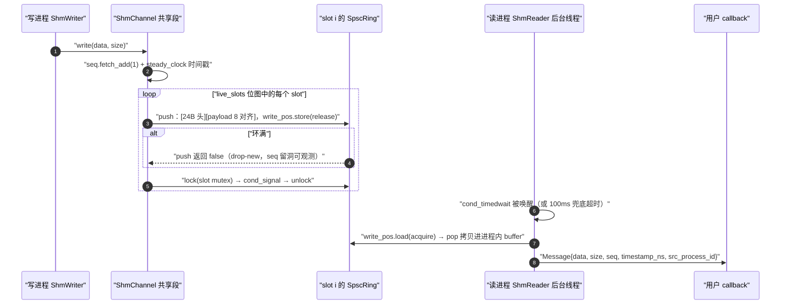
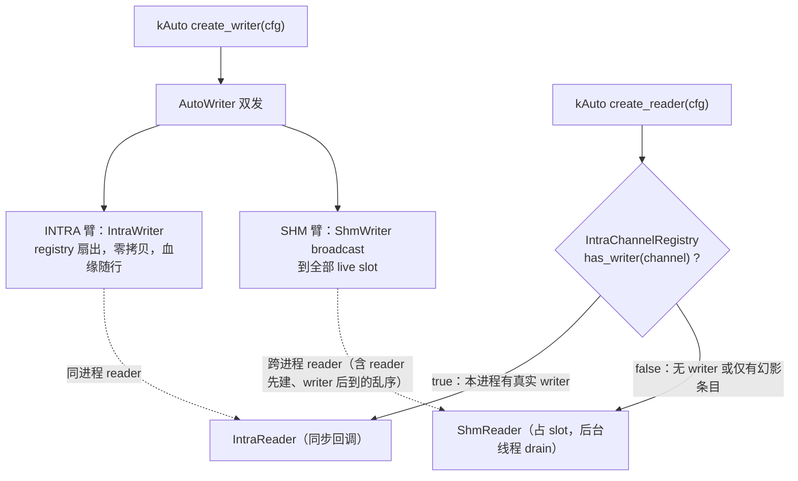

# 传输层（`tianshu/transport` + `tianshu/shm`）

> 状态：✅ 已实现（Phase 1：INTRA + SHM 跨进程 + kAuto）—— 一套 `TransportBackend` 可插拔抽象之下，同进程零拷贝（INTRA）、同机跨进程（SHM 命名段）与无 discovery 的自动选路（kAuto 双发）均已落地，并以 `tianshu/shm` 原语 + schema sidecar 构成 Phase 2 通用 SHM 基础设施的地基；跨机（Zenoh）属规划。
> 代码：`tianshu/include/tianshu/{transport,shm}/` · `tianshu/src/{transport_backend,intra_backend,shm_backend,hybrid_transport,schema_sidecar,shm_segment}.cc`
> 关键 ADR：[ADR-0010 Transport 抽象 + SHM 基础设施](../../adr/0010-transport-shm-infra.md)（决策 5 = SHM channel 落地架构） · [ADR-0013 跨机传输（Zenoh，规划）](../../adr/0013-cross-machine-transport.md) · [ADR-0020 消息反射与 schema sidecar](../../adr/0020-message-reflection-monitor.md) · [ADR-0023 kAuto 自动选路 v0](../../adr/0023-kauto-transport-v0.md)
> 实现细节与踩坑：[development/shm-transport-notes.md](../../development/shm-transport-notes.md) · 评估：[evaluation/0001 跨机选型](../../evaluation/0001-cross-machine-transport.md) · [evaluation/0002 fork 共享地址空间](../../evaluation/0002-fork-shared-address-space.md)
> 测试：`tests/transport/`（4 文件）· `tests/shm/shm_primitives_test.cc` · 基准：`benchmarks/shm_transport_benchmark.cc` · 示例：`examples/{shm_talker,shm_listener,intra_example}.cc`
> 最后同步：2026-09-09 · commit `86b9ff3`

---

## 1. 职责与边界

**做什么**：

- **统一后端抽象**（L4-TRANS-18）：`TransportBackend` 接口 + `TransportRegistry`，所有传输实现（INTRA / SHM / Zenoh / CUSTOM）可插拔替换，用户与编译器不感知具体后端。
- **INTRA 同进程零拷贝**（L4-TRANS-20）：writer 直接调用 reader 回调，无序列化、无 SHM 分配，消息指针直传；Node 默认模式。
- **SHM 同机跨进程**（L4-TRANS-3/4）：每 channel 一个命名共享段，slot-per-reader 固定布局，writer 广播 + `PTHREAD_PROCESS_SHARED` condvar 唤醒；仅 Linux hosted profiles（embedded/mcu 走 INTRA，见 [ADR-0010](../../adr/0010-transport-shm-infra.md) profile 矩阵）。
- **kAuto 自动选路**（L4-TRANS-21，[ADR-0023](../../adr/0023-kauto-transport-v0.md)）：写端双发（INTRA + SHM）+ 读端注册表判定，任意创建顺序下正确，v0 无需 discovery 服务。
- **shm/ 通用原语**（L4-TRANS-24 等）：`offset_ptr` / `ShmSegment` / `SpscRing`，独立于 transport 可复用，是 Phase 2 `ShmPool` 通用分配器的地基。
- **schema sidecar**（[ADR-0020](../../adr/0020-message-reflection-monitor.md) Phase 2）：writer 把通道 schema blob 发布到 ring 段旁边的独立小段，ti-monitor 等接收端免链接发布者类型即可解码。
- **消息元数据**（L4-TRANS-5）：`Message` 携带 `seq` / `timestamp_ns` / `src_process_id` / `lineage_ptr`（血缘指针以 `const void*` 透明穿越传输层）。

**不做什么**：

- **跨机传输未实现**：`ZenohBackend` 属 [ADR-0013](../../adr/0013-cross-machine-transport.md) 规划（Phase 2，feature flag `TIANSHU_WITH_ZENOH`，MCU 走 Zenoh-pico）；当前所有后端 `supports_remote()` 均为 `false`。
- **SHM 读侧不是零拷贝**：`ShmReader` 把 payload 从 ring `pop` 进进程内 buffer 再回调，故 `ShmBackend::supports_zero_copy()` 为 `false`。
- **无 QoS**：环满策略固定为丢新（drop-on-full）；`ChannelConfig::queue_size` 字段存在但尚无后端消费（SHM 容量由 `kRingCapacity` 常量决定）——每 channel 可配化待 L4-TRANS-8。
- **无服务发现**：kAuto v0 显式不依赖 discovery（[ADR-0015](../../adr/0015-discovery-abstraction.md) 抽象已定、未实现）。
- **无通用 SHM 分配器**：`ShmPool`（L4-TRANS-22）未实现；channel 段走固定布局，**不用** ShmPool（ADR-0010 决策 5.1 的明确划分）。
- **schema 分发仅 POD 已闭环**：Protobuf / FlatBuffers 的 blob 格式已定，解码器随依赖引入后补齐（[ADR-0020](../../adr/0020-message-reflection-monitor.md) 分期）。

## 2. 公共 API 速览

### 2.1 `TransportBackend` 接口（`tianshu/transport/transport_backend.h`，namespace `tianshu::transport`）

| 类型 / 函数 | 说明 |
|---|---|
| `BackendType` | 枚举：`kIntra` / `kShm` / `kZenoh` / `kCustom` |
| `MessageFormat` | 枚举：`kPod` / `kFlatBuffers` / `kProtobuf` |
| `TransportMode` | 枚举：`kIntra` / `kShm` / `kAuto`（HybridTransport / Node 构造参数） |
| `ChannelConfig` | `channel_name` · `msg_type_name` · `queue_size`（默认 16）· `format`（默认 `kPod`）· `schema_blob`（可选，ADR-0020，SHM sidecar 发布） |
| `Message` | `data` · `size` · `seq` · `timestamp_ns` · `src_process_id` · `lineage_ptr`（L4-TRANS-5 元数据） |
| `WriterBase` | `write(data, size)`；血缘重载 `write(data, size, lineage_ptr)`（默认实现丢弃血缘；指针须指向存活至同步写结束的 `core::Lineage`） |
| `ReaderBase` | `set_callback(cb)` · `channel()` |
| `TransportBackend` | `type()` · `supports_zero_copy()` · `supports_remote()` · `create_writer(cfg)` · `create_reader(cfg)`（失败返回 `nullptr`） |
| `TransportRegistry` | 单例：`register_backend(type, factory)`（立即以工厂构造并持有实例）· `get(type)`——自定义后端接入点 |

### 2.2 `IntraBackend`（`intra_backend.h`，namespace `tianshu::transport::intra`）

| 类型 | 说明 |
|---|---|
| `IntraBackend` | `kIntra`，`supports_zero_copy() == true`；`create_writer` 经 registry 标记真实发布者，`create_reader` 附着共享 writer |
| `IntraWriter` / `IntraReader` | writer 持原子 `seq` 与回调表，`write` 在 `callbacks_mutex_` 下同步遍历回调（零拷贝、零序列化；设计目标 ~10-100ns/消息）；同 channel 多 writer 经 registry 指向同一底层 `IntraWriter`，seq 连续 |
| `IntraChannelRegistry` | 单例三方法：`get_or_create_writer`（reader 附带创建，**幻影条目**，不算发布者）· `register_writer`（create_writer 路径，标记 `published_`）· `has_writer`（kAuto 读端判定依据） |

### 2.3 `shm/` 原语（namespace `tianshu::shm`）

| 类型 | 关键成员 | 说明 |
|---|---|---|
| `offset_ptr<T>` | `get()` · `operator*` / `->` / `bool` / `==` · `raw_offset()` · `operator=(T*)` | 自相对偏移指针（L4-TRANS-24）：存 `target − this`，ASLR 安全；offset 0 = null；copy/move 一律从 raw target 重算 |
| `ShmSegment` | `open_or_create(name, size)` · `open_existing(name)` · `data()` · `size()` · `name()`；`kMagic` | 命名段 RAII（shm_open + mmap）；`SegmentHeader`（magic/refcount/size）私有，`data()` 返回其后的 payload 区；refcount 最后离场者 `shm_unlink`；attach 全程走已打开的 fd 映射（名字被并发重建也不漂移） |
| `SpscRing` | `create(mem, cap)` · `attach(mem)` · `push(data, size, meta)` · `pop(*out, *meta)` · `empty()` · `used()` · `total_size(cap)`；`Metadata{seq, timestamp_ns}` | 无锁 SPSC 字节环：消息布局 `[24B 头：size+seq+ts][payload 补齐到 8]`；尾部 `size=0` wrap 跳过标记；环满 `push` 返回 `false`（drop-on-full） |

### 2.4 `ShmBackend`（`shm_backend.h`，namespace `tianshu::transport::shm`）

| 类型 / 常量 | 说明 |
|---|---|
| `kMaxReaders = 8` · `kRingCapacity = 256 KiB` · `kChannelMagic` | 每 channel 最多 8 个 reader slot，每 slot 一个 256KB ring（段约 2MB）；硬编码，可配化属 Phase 2 |
| `ChannelHeader` | `magic`（CAS 状态机）· `live_slots`（slot 位图）· `seq` · `writer_pid` · 几何参数（`max_readers` / `ring_capacity` / `slot_stride`） |
| `SlotHeader` | `pthread_mutex_t` + `pthread_cond_t`（均 `PTHREAD_PROCESS_SHARED`，cond 挂 `CLOCK_MONOTONIC`） |
| `ShmChannel` | `open(channel)` · `acquire_slot` / `release_slot` / `reset_slot` · `slot_ring` · `signal_slot` · `broadcast(data, size)`（扇出到全部 live slot，返回服务数） |
| `ShmWriter` / `ShmReader` | writer 一次 `write` = 一次 `broadcast`；reader 构造即起后台线程 drain 本 slot ring，析构时 signal + join + 释放 slot |
| `ShmBackend` | `create_writer` 顺带发布 `cfg.schema_blob`（非空时写 sidecar）；`create_reader` 抢 slot，满则返回 `nullptr` |

### 2.5 `HybridTransport` + kAuto（`hybrid_transport.h`，namespace `tianshu::transport`）

| 类型 | 说明 |
|---|---|
| `HybridTransport(mode)` | 默认 `kIntra`；持有 intra + shm 两个后端。`kIntra`/`kShm` 直通对应后端；`kAuto` 走双发/判定逻辑 |
| `AutoWriter` | kAuto 写端：每次 `write` 同时发 INTRA 臂与 SHM 臂；血缘重载只在 INTRA 臂携带 `lineage_ptr`（SHM 血缘序列化 = Phase 2，[ADR-0025](../../adr/0025-from-component-reference.md) 修正）；`channel()` 委托 INTRA 臂 |

### 2.6 schema sidecar（`schema_sidecar.h`，namespace `tianshu::transport::shm`）

| 函数 | 说明 |
|---|---|
| `segment_name_for(channel)` / `schema_segment_name_for(channel)` | 段名派生：channel 名 FNV-1a 哈希 → `/tianshu_ch_<hash>` 与 `/tianshu_schema_<hash>` |
| `write_channel_schema(channel, blob, size)` | 发布 schema 到一页 sidecar 段；幂等（首写者胜出）；keepalive 持段至进程退出；blob 超一页为 no-op |
| `read_channel_schema(channel, *blob)` | 读取已发布 schema；无 sidecar（未类型化发布者）或 payload 畸形/截断返回 `false` |

**与 core 的桥**：schema 编解码器住在 core 侧——`Node::create_typed_writer<T>`（`core/node.h`）在 `T` 带 `TIANSHU_TRAITS_POD_FIELDS` 字段表时用 `encode_pod_schema` 自动编码进 `ChannelConfig::schema_blob`，`ShmBackend::create_writer` 再调 `write_channel_schema` 落段；ti-monitor 经 `read_channel_schema` + `DecoderRegistry`（`(format, type_name) → decoder` 单例）免参数自动解码。

### 2.7 真实用法（摘自 examples）

**同进程 INTRA**（`examples/intra_example.cc`）：`Node` 默认 `kIntra`，写字符串通道并同步回调——

```cpp
tianshu::core::Node node;
auto writer = node.create_writer("/test/intra", "string");
auto reader = node.create_reader("/test/intra", "string");
reader->set_callback([&](const tianshu::transport::Message& msg) { /* msg.data 直传 */ });
writer->write(msg.data(), msg.size());   // 回调在 write() 内同步触发
```

**跨进程 SHM**（`examples/shm_talker.cc` / `examples/shm_listener.cc`，两个终端、启动顺序无关）：

```cpp
// talker：TIANSHU_TRAITS_POD_FIELDS(ImuData, ...) 注册字段表（静态初始化进 DecoderRegistry），
// 经 create_typed_writer 自动发布 schema sidecar
tianshu::core::Node node(tianshu::transport::TransportMode::kShm);
auto writer = node.create_typed_writer<ImuData>("/sensing/imu");
writer->write(imu);                                    // 10 Hz 循环

// listener：try_fetch() 为「取最新值」语义（不消费，重复调用返回同一消息直到新消息到达），
// 去重靠 last_seq() 变化比对并累计 gap
auto reader = node.create_typed_reader<ImuData>("/sensing/imu");
if (const ImuData* imu = reader->try_fetch()) { /* reader->last_seq() ... */ }
```

## 3. 内部设计

### 3.1 段布局与一次跨进程写-读

每 channel 一个命名段（`ShmChannel::init` 用 `segment_total_size(kRingCapacity)` 一次性建好固定布局）：

```text
/dev/shm/tianshu_ch_<fnv1a(channel)>            ← segment_name_for()
┌────────────────────────────────────────────────┐
│ SegmentHeader   magic · refcount · size        │ ← ShmSegment 私有，用户不可见
│ ChannelHeader   magic(CAS 状态机) · live_slots │ ← 0 → INITIALIZING → READY
│                 · seq · writer_pid · 几何参数   │
│ slot 0  [pshared mutex+cond][SpscRing 256 KiB] │ ← 每 reader 独占一个 slot
│ slot 1  …                                      │
│ …      slot 7（kMaxReaders = 8，段约 2 MiB）    │
└────────────────────────────────────────────────┘
/dev/shm/tianshu_schema_<fnv1a(channel)>         ← sidecar（独立一页）
[u64 magic][u32 blob_len][schema blob]
```

一次跨进程写-读的完整时序：



### 3.2 kAuto：双发写端 + 读端注册表判定



### 3.3 机制要点

- **offset_ptr 自相对偏移**：存 `target − this`，两端映射基址漂移在减法中抵消，`get()` 一次加法；offset 0 = null（成员不可能合法指向自身）。**copy/move 四个操作全部从 raw target 重算**，禁止直接复制 offset 字段——偏移语义取决于实例自身位置，仅 null 位置无关（单测锁定；[shm-transport-notes 决策 1](../../development/shm-transport-notes.md)）。偏移用 `uintptr_t` 减法计算，规避 `[expr.add]` 对无关对象指针相减的 UB（GCC -O3 曾借此误编译指针比较）。**仅在单一连续映射内有效**。
- **CAS 初始化状态机**：`magic` 字段三态 `0 →(CAS) INITIALIZING →(release) READY`。共享 mutex 无法解决初始化互斥（初始化 pshared mutex 本身就需要同步，鸡生蛋），裸内存 CAS 无引导问题；输家以 500µs 间隔轮询（最多 2000 次）等 READY，acquire 读到即建立 happens-before。段创建侧的竞态由 `ShmSegment` 处理：`shm_open(O_CREAT|O_EXCL)` 赢家 ftruncate + 发布 magic；输家先等 fstat 出尺寸（防零尺寸对象 mmap SIGBUS）、再探针页等 magic、按头内总尺寸从**同一 fd** 全量 mmap（fd 锚定原对象，名字被并发 unlink + 重建也不漂移）。
- **每 reader 独占 slot**：`live_slots` 位图 `fetch_or(1 << i)` 一次 RMW 完成「测试 + 占位」（tmpfs 共享页上跨进程原子 RMW 由 MESI 保证）；抢位成功先 `reset_slot` 重建 ring（防前任 reader 崩溃留脏状态）；8 slot 占满则 `create_reader` 返回 `nullptr`，释放后可复用。
- **PTHREAD_PROCESS_SHARED condvar + CLOCK_MONOTONIC**：必须有 mutex 保护谓词（否则经典丢失唤醒）；强制 `condattr_setclock(CLOCK_MONOTONIC)`——timedwait 默认 CLOCK_REALTIME，墙钟跳变（NTP step）会破坏超时，车载硬约束；100ms timed-wait 兜底只服务故障路径（signal 丢失时保证析构可 join）。
- **drop-on-full**：环满丢新消息、`push` 返回 `false` 供 writer 计数；已收消息的完整性与顺序不动，`seq` 空洞即 reader 可观测的丢包计数。消息尾部 wrap 用 `size=0` skip 标记，换 memcpy 永远连续。
- **双发写端 + 读端注册表判定**：`AutoWriter` 每次 write 双发；kAuto 读端查 `has_writer` 选路。零读者的 SHM broadcast 近零成本（`live_slots == 0` 时只一次原子 `seq` 递增）；**真实 writer 与幻影条目严格区分**（reader 附带创建的 registry 条目不标记 `published_`），否则 reader-only 通道会把后续 kAuto reader 误导向 INTRA 而饿死。代价：每个 kAuto 通道在 `/dev/shm` 预留一个段（内核惰性分配，未触碰页不占物理内存）。
- **schema sidecar 段与发布协议**：`/tianshu_schema_<fnv1a>` 独立一页段（零改动现有段布局）；payload `[u64 magic][u32 blob_len][blob]`，**blob 先写、magic release-store 收尾**，读者 acquire 后校验长度再拷出；首写者胜出（幂等），keepalive 持段至进程退出使其存活期长于发布它的 `WriterBase`。
- **段生命周期**：`ShmSegment` 析构 `fetch_sub` refcount，最后一个解除映射者 `shm_unlink`；进程内 `ShmChannelRegistry` 持 `weak_ptr`（非 strong），段存活期由实际打开的端点数决定。

## 4. 与其它模块的关系

- **依赖（向下）**：transport + shm 仅依赖 C++ 标准库与 POSIX（`pthread` / `shm_open` / `mmap` / `clock_gettime`），**零 tianshu 内部依赖**——分层最底座，被任何模块安全引用。
- **被 core 消费**：`core::Node` 持有 `HybridTransport` 实例并按 `TransportMode` 建端点（`core/node.h`）；typed `Writer<T>` / `Reader<T>` 是传输层之上的类型化薄封装（`write(msg, lineage_ptr)` 透传血缘指针）；`core/field_table.h` 的 `encode_pod_schema` 提供侧车编解码；`core/monitor.cc` 在 attach 时 `read_channel_schema` 自动装载 schema（ti-monitor 免 `--decode` 解码）。
- **被 dsl 消费**：DSL 源通道直驱 `DataDispatcher`（不经 transport）；`from()` 组件引用的桥接用 `transport::ReaderBase` 把组件输出通道泵回 DSL 运行时（`dsl/dsl_runtime.h` 的 `bridge_readers_`）。
- **血缘边界**：`Message::lineage_ptr` 以 `const void*` 穿越传输层（不引入 core 头依赖）；INTRA 臂同步携带，SHM 臂丢弃——SHM 血缘序列化记录为 Phase 2 演进（[ADR-0025](../../adr/0025-from-component-reference.md) 修正，`AutoWriter` 注释）。
- **Phase 2 展望**：`ShmPool` 通用分配器落地后，lineage buffer / state checkpoint / GPU pinned memory 统一改用（[ADR-0010](../../adr/0010-transport-shm-infra.md) 影响范围表）；channel 段维持固定布局不迁移。

## 5. 设计决策与被否方案

| # | 决策 | 被否方案与理由 | 出处 |
|---|---|---|---|
| 1 | **固定布局 slot-per-reader 段模型** | ShmPool 动态分配：跨进程分配器自身又需共享状态——递归依赖；固定布局零分配、O(1) 寻址、崩溃可复位。代价 kMaxReaders=8 / ring 256KB 硬编码（每 channel ~2MB） | [ADR-0010 决策 5.1](../../adr/0010-transport-shm-infra.md) |
| 2 | **magic 字段 CAS 初始化状态机** | 共享 mutex 做初始化互斥：初始化 pshared mutex 本身就要同步，鸡生蛋 | ADR-0010 决策 5.2 |
| 3 | **pshared condvar + CLOCK_MONOTONIC** | eventfd：跨进程 fd 传递走 SCM_RIGHTS，生命周期跨 exec 恶劣；裸 futex：condvar 协议（丢失唤醒/虚假唤醒/predicate）陷阱多。glibc pshared condvar 底层即共享页 futex | ADR-0010 决策 5.3 |
| 4 | **环满丢新（drop-new）** | 阻塞 writer：迟钝 reader 向生产者注入无限延迟，同步 `write()` API 不可接受；丢最旧：破坏 SPSC ring 消息边界，跨消息跳读复杂度陡增 | ADR-0010 决策 5.4 |
| 5 | **refcount + 最后离场者 unlink** | 崩溃残留 = tmpfs 内存泄漏（Phase 2 需 reaper）；三条泄漏路径的修复记录见 [shm-transport-notes 决策 6](../../development/shm-transport-notes.md) | ADR-0010 决策 5.5 |
| 6 | **kAuto = 双发 + 注册表判定** | 创建时一次性选路：乱序创建即错配；intra 为主 + 检测远端读者后桥接：桥接启动前丢消息，且"发现"仍需轮询/discovery | [ADR-0023](../../adr/0023-kauto-transport-v0.md) |
| 7 | **offset_ptr 自研** | Boost.Interprocess：依赖治理禁 Boost 全套；自研 ~100 行精简版零第三方依赖；ForkSHM（fork 共享地址空间）需关 ASLR/PIE——安全风险高且业界主流（Boost/Iceoryx）均不依赖地址一致，保留 P2 占位（L4-TRANS-14..17） | ADR-0010 · [evaluation/0002](../../evaluation/0002-fork-shared-address-space.md) |
| 8 | **跨机走 Zenoh（规划）** | 自研轻量 DDS / Fast-DDS / CycloneDDS / MQTT / gRPC 候选对比后推荐 Zenoh（Apache-2.0 子许可 + MCU 走 Zenoh-pico） | [evaluation/0001](../../evaluation/0001-cross-machine-transport.md) → [ADR-0013](../../adr/0013-cross-machine-transport.md) |
| 9 | **sidecar = 独立小段** | `ChannelHeader` 加 `schema_offset`：变更在飞段的 ABI；独立段零改动布局，定额成本一页/通道 | [ADR-0020](../../adr/0020-message-reflection-monitor.md) 决策 4 |

**关键陷阱**（详见 [shm-transport-notes](../../development/shm-transport-notes.md)）：① offset_ptr copy/move 直接复制 offset 是潜伏 bug，必须重算；② 早期版本 `data()` 返回映射基址导致 `ChannelHeader` 践踏 `SegmentHeader`（refcount 永不到 0、永不 unlink）——修复为私有头 + 偏移，**残留段本身就是布局 bug 的证据链**，改布局后必须清 `/dev/shm` 再测；③ fork 测试 child 的 `_exit()` 跳过析构，refcount 不递减——child 须在作用域块内先跑完析构；④ `try_fetch()` 是取最新值语义，按每次轮询计数会无符号下溢（曾报 2⁶⁴ drops），去重须比对 `last_seq()`。

## 6. 测试 / 基准 / 示例入口

**测试**（`tests/transport/` + `tests/shm/`）：

| 文件 | 覆盖 |
|---|---|
| `transport_backend_test.cc` | TransportRegistry（L4-TRANS-18）：注册/获取/未注册返回 null/经注册后端建端点 |
| `intra_backend_test.cc` | IntraBackend（L4-TRANS-20）：单/多 reader 扇出、多 writer seq 连续、reader-before-writer、写先于 set_callback、空消息、通道隔离 |
| `shm_backend_test.cc` | ShmBackend（L4-TRANS-3/4）+ sidecar：同进程 e2e、多 reader 扇出、slot 占满返回 null 与释放复活、registry 过期条目重开、Node SHM 模式 e2e、**fork 跨进程 e2e**（管道握手保证 reader 先注册，100 消息序验证）、schema roundtrip / 缺失 / 后端自动发布 |
| `hybrid_transport_test.cc` | HybridTransport（L4-TRANS-19）+ kAuto（L4-TRANS-21）：多态访问、kShm 选路、**同进程优先 INTRA（dynamic_cast 验证 + write 内同步送达）**、**reader 先于 writer 仍被服务**、**fork 跨进程回退 SHM**、**幻影 writer 不计数** |
| `../shm/shm_primitives_test.cc` | offset_ptr（null/往返/链表遍历/copy 保目标/move 转移/置空）；ShmSegment（建写读毁/attach 可见/并发 open/非法名/缺目录/裸段超时/伪造超大头失败/RLIMIT_FSIZE 注入）；SpscRing（往返/空 pop/FIFO/环满丢新/wrap 保序/双线程 20000 消息并发） |

**基准与验收数字**（`benchmarks/shm_transport_benchmark.cc`，fork 双进程、64B 消息；刻意跑在 GoogleBenchmark 进程模型之外，纯文本报告）：

| 指标 | 验收标准 | 实测 |
|---|---|---|
| 跨进程吞吐 | ≥ 1M msg/s | **4.17M msg/s**（4 倍余量） |
| RTT 延迟（send→child 收→ack→parent 收） | < 1 ms | **p50 = 58µs · p99 = 68µs**（17 倍余量） |

复现：`./build/desktop-clang/bin/shm_transport_benchmark [msgs] [samples]`（默认 200000 / 200）。

**示例**：`examples/intra_example.cc`（同进程零拷贝演示）；`examples/shm_talker.cc` + `examples/shm_listener.cc`（两终端跨进程 ImuData 收发，启动顺序无关，talker 带字段表自动发布 sidecar）——已验证 35/35 消息、0 丢弃、有序、`/dev/shm` 零残留。

## 7. 已知限制与演进方向

- **跨机传输（Zenoh）**：未实现，[ADR-0013](../../adr/0013-cross-machine-transport.md) 规划 Phase 2（L4-TRANS-6 / 28..32；feature flag `TIANSHU_WITH_ZENOH`；MCU 走 Zenoh-pico 子集）。落地后 `BackendType::kZenoh` 补齐，用户代码经 `TransportBackend` 抽象零改动。
- **ShmPool 通用分配器**：未实现（L4-TRANS-22，[ADR-0010](../../adr/0010-transport-shm-infra.md) 决策 2 的 4 池策略 + Stats）；落地后服务 lineage / state checkpoint / GPU pinned memory / 用户 SHM 容器，channel 段不迁移。offset_ptr 需随之扩展**多区段二级编码**（区段 ID + 段内偏移）。
- **SHM 臂血缘序列化 = Phase 2**：`AutoWriter` 当前血缘只走 INTRA 臂，跨进程消息 `lineage_ptr` 为空（[ADR-0025](../../adr/0025-from-component-reference.md) 修正记录）。
- **kAuto → 拓扑驱动**：[ADR-0015](../../adr/0015-discovery-abstraction.md) DiscoveryBackend 落地后，kAuto 切换为按 (channel × 本地/远端读者集合) 精确选路，撤掉双发与预留段，`AutoWriter` 退役；现有顺序无关/幻影测试作为重构守护。
- **可配化**：kMaxReaders=8 / ring 256KB 硬编码；环满策略固定 drop-new——L4-TRANS-8（QoS）落地后改每 channel 可配（状态估计类话题宜丢旧保新鲜）。
- **健壮性**：初始化赢家中途崩溃的 stale 段（卡 INITIALIZING）需带时间戳的 reaper 回收；崩溃残留段 = tmpfs 内存泄漏同样待 reaper；fork child 内 reader 线程 `join()` 在 POSIX 层面是 UB（实测 glibc 立即返回），硬化方向 `pthread_atfork` 子侧 detach 或重构为 fork 前不启线程。
- **schema 分发**：Protobuf（FileDescriptorSet）/ FlatBuffers（reflection.Schema）blob 格式已定、解码器未实现（随 L4-CORE 依赖引入补齐，接口不变）；`ChannelConfig::queue_size` 尚无后端消费。
